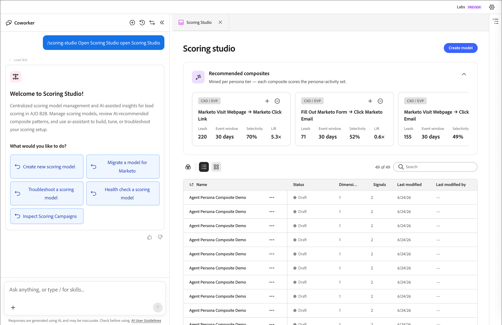

# 建立自訂評分模型

>[!CONTEXTUALHELP]
>id="ajo-b2b-prime_scoring_studio"
>title="評分工作室"
>abstract="透過 Coworker 聊天介面，使用「評分工作室」技能來建立、設定和發佈自訂銷售線索評分模型。"

[!DNL Adobe Marketo Optimizer]中的&#x200B;[_評分工作室_&#x200B;技能](./skills.md#scoring-signals)提供AI原生潛在客戶評分解決方案，可讓您建立、設定和發佈潛在客戶評分模型。 Studio結合代理程式驅動的工作流程與視覺化UI — 您可以透過[同事聊天介面](./chat-interface.md)中的自然語言提示或直接與UI控制項互動來建立評分模型。

* **技能** - `scoring-studio`
* **引動** — 使用斜線命令開啟Scoring Studio。 例如： _「開啟評分工作室」_。
* **從**&#x200B;讀取/寫入 — [!DNL Marketo Optimizer]評分服務；讀取[!DNL Marketo Engage]潛在客戶欄位和活動型別

啟動時，「同事」會自動擷取相關內容（包括活動型別、潛在客戶欄位、人員清單及現有分數清單），以便在您的資料中建立其建議。

{width="700" zoomable="yes"}

## 建立評分模型 {#create-model}

當您開啟Scoring Studio時，Co-worker會建議一個預先填入靜態清單和一組已評分活動的相關範例評分模型。 您可以接受這個建議的起點，或提供自己的提示來定義自訂模型。

### 預覽模型 {#preview-model}

在您提供提示後，Co-worker會在進行任何變更之前產生模型預覽。 預覽曲面：

* 評分維度正在使用中
* 正在評分的屬性和活動
* 以區段套用的靜態清單或智慧清單
* 模型目標、目標區段和主要訊號的摘要

您可以檢閱預覽並選擇根據它建立模型，或在最終確定之前繼續修改聊天。

### 模型結構 {#model-structure}

建立的模型已組織為&#x200B;_維度_&#x200B;和&#x200B;_訊號_。 您可以使用UI中的屬性面板來設定每個訊號：

* **訊號型別** — 以活動或屬性為基礎
* **活動或屬性** — 要評分的特定專案
* **訊號引數** — 訊號的可調整設定

您可以使用自然語言完全透過Co-worker建立及設定模型，或直接與UI控制項互動。

## 發佈評分模型 {#publish-model}

模型完成後，指示Co-worker將其發佈。 發佈程式會自動處理以下內容：

| 步驟 | 發生什麼情況 |
| --- | --- |
| **規則編譯** | 所有評分規則都會經過編譯和驗證 |
| **分數任務建立** | 已建立排程的分數工作，並設定為每日執行 |

發佈後，您也可以選擇觸發手動執行，以立即處理分數。

## 檢視評分結果 {#view-results}

評分回合完成時，分數會透過潛在客戶匯入程式回寫至[!DNL Marketo Engage]。 匯入完成之後，可以直接在[!DNL Marketo Engage]中驗證更新的分數。

每次執行後，您都可以檢視結果摘要，其中顯示：

* 有多少人已評分
* 每個人的個別分數會變更

稽核記錄可用於檢閱其他執行詳細資訊。
