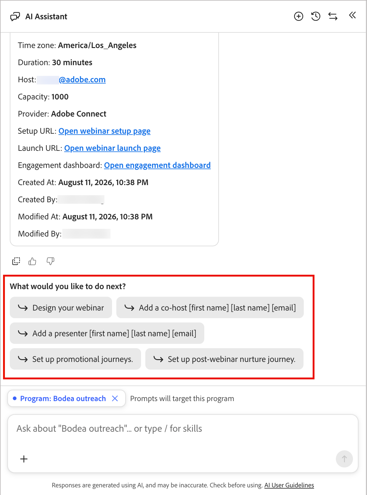

# 建立和推廣網路研討會

[聊天介面](./chat-interface.md)可以從網路研討會建立到促銷、傳遞、後續網路研討會培養及報告 — 完全透過對話窗格。 聊天介面建置的所有專案都使用[互動式網路研討會概觀](../marketing/webinars-overview.md)中所述的相同網路研討會資產、歷程和權杖，因此您可以隨時在聊天和設計介面之間移動。

## 進入點

從「歡迎使用行銷管理」問候語中，選取&#x200B;**[!UICONTROL 網路研討會]**&#x200B;類別晶片以檢視建議的提示，包括：

* *「排程並傳遞網路研討會」*
* *「顯示我所有即將舉辦的網路研討會」*
* *&quot;提供網路研討會詳細資料[網路研討會名稱]&quot;*

{width="700" zoomable="yes"}

當您從程式內部開啟聊天窗格時，其範圍會自動提示至該程式。

## 新增排程的網路研討會 {#add-webinar}

以單一訊息說明您想要的網路研討會，例如：

*「針對[計畫]，於2026年10月12日下午4點（美洲/洛杉磯）建立名為「網路安全101：保護您的資料免受現代威脅」的互動式網路研討會。」*

1. 聊天窗格會顯示&#x200B;**工作計畫**&#x200B;檢查清單並處理它：解析程式、設定名稱、開始時間、結束時間、時區和容量，然後確認。

   {width="500" zoomable="yes"}

1. 聊天窗格會列出您可用的網路研討會&#x200B;**授權** （例如，具有容量值的高容量附加元件），並詢問要使用哪個附加元件。 以您想要的容量回覆，例如&#x200B;*「使用1000的網路研討會容量」。*

   {width="500" zoomable="yes"}

1. 聊天窗格會回應程式、名稱、開始時間、時區、持續時間及容量，並要求您&#x200B;**確認**，然後再建立網路研討會。

1. 建立網路研討會後，聊天介面會顯示&#x200B;**網路研討會卡**，其中包含開始和結束時間、持續時間、主機、容量、提供者(Adobe Connect)、設定URL、啟動URL、參與儀表板連結以及建立中繼資料。

1. 然後聊天介面會提供&#x200B;**次最佳動作**： _設計您的網路研討會_、_新增共同主持人_、_新增簡報者_、_設定促銷歷程_&#x200B;以及&#x200B;_設定後續網路研討會培養歷程_。

   {width="500" zoomable="yes"}

### 新增共同主機和主持人 {#co-hosts-presenters}

選取&#x200B;**[!UICONTROL 新增共同主機]**&#x200B;或&#x200B;**[!UICONTROL 從次佳動作新增簡報者]**，或直接詢問，例如&#x200B;*「新增共同主機[名字] [姓氏] [電子郵件]。」* 聊天介面會開啟設計工具中使用的相同新增對話方塊 — 輸入名稱和電子郵件，因為目前每個人的新增方式都相同，而不是從名冊選擇器中選取。 在新增人員後，確認隨即出現。

{width="500" zoomable="yes"}

### 設計網路研討會

選取&#x200B;**[!UICONTROL 設計您的網路研討會]**&#x200B;以開啟網路研討會設定頁面，您可在其中設定內嵌[!DNL Adobe Connect]設計介面的內容、版面及註冊設定。 在該介面中完成任何設計變更；聊天介面會連結您到那裡，而不是在聊天中設計聊天室。 請參閱[設計網路研討會](../marketing/create-webinar.md#create-and-design-a-webinar)。

{width="500" zoomable="yes"}

## 建立促銷活動歷程

1. 要求聊天介面設定促銷歷程。

   它會要求您選擇範本並命名歷程，例如&#x200B;*「邀請/註冊歷程」*。

1. 聊天介面會建立歷程並將電子郵件連結至其節點，以建立包含網路研討會成員狀態更新的邀請和提醒流程。

1. 聊天介面會列出在歷程畫布中尚待設定的專案。

1. 按一下&#x200B;**[!UICONTROL 編輯歷程節點]**，並回應有關完成歷程所需內容的詢問。

   您可以上傳行銷活動檔案以提供詳細資訊，或繼續聊天以識別所需專案。

   或者，您可以直接在歷程畫布中處理每個節點：

   * 選取第一個歷程節點並設定歷程對象。 [了解更多](../marketing/person-audience-node.md)
   * 選取邀請&#x200B;_傳送電子郵件_&#x200B;節點並按一下&#x200B;**[!UICONTROL 編輯電子郵件]**。 [了解更多](../marketing/email-channel.md)
   * 選取[接聽事件]節點，然後按一下[編輯事件] **&#x200B;**。 在&#x200B;_填寫表單_&#x200B;事件上設定登錄檔單的事件篩選器。 [了解更多](../marketing/listen-for-event-nodes.md#event-filters)
   * 驗證每個狀態變更節點上的&#x200B;**[!UICONTROL 變更網路研討會成員狀態]**&#x200B;欄位。 [了解更多](../marketing/action-nodes.md#actions-and-constraints)

1. 完成其他節點和位址的設定

1. 完成時，按一下&#x200B;**[!UICONTROL 立即發佈]**，讓歷程上線並開始促銷活動。

## 建立後續網路研討會歷程

1. 詢問聊天介面以進行後續網路研討會歷程。

   它會提示您輸入範本和名稱。

1. 聊天介面會建立包含已定義路徑和動作的&#x200B;**分割路徑**&#x200B;節點：

   * **_已出席_**&#x200B;分支（例如，回覆和資源&#x200B;_傳送電子郵件_&#x200B;節點）
   * **_No-Show_**&#x200B;分支(例如，「錯過？」 重新觀看&quot; _傳送電子郵件_&#x200B;節點)

   每個節點後面都有一個&#x200B;_等待_&#x200B;和後續的&#x200B;_傳送電子郵件_&#x200B;節點。

   分割條件設定為使用&#x200B;_已出席網路研討會_&#x200B;來識別網路研討會狀態。

1. 按一下&#x200B;**[!UICONTROL 編輯歷程節點]**，並回應有關完成歷程所需內容的詢問。

   您可以上傳行銷活動檔案以提供詳細資訊，或繼續聊天以識別所需專案。

   或者，您可以直接在歷程畫布中處理每個節點。

1. 完成其他節點和位址的設定

1. 完成時，請按一下&#x200B;**[!UICONTROL 立即發佈]**，讓歷程上線並開始後續追蹤。

## 檢查報告

在聊天介面中，您可以詢問報告問題，例如&#x200B;*「顯示我所有即將舉辦的網路研討會」*&#x200B;或&#x200B;*「提供網路研討會的詳細資料[名稱]」*。 它會顯示參與儀表板連結以及次佳動作，例如&#x200B;**設計**、**新增共同主機**&#x200B;或&#x200B;**於網路研討會日期**&#x200B;發佈。

如需更深入的分析 — 出席率、投票和調查績效，以及每個成員的資料 — 聊天介面會連結至網路研討會的&#x200B;**分析**&#x200B;和&#x200B;**成員**&#x200B;標籤，以及&#x200B;**網路研討會管理**&#x200B;中的跨程式統計。<!-- See [Webinar reporting](https://experienceleague.adobe.com/en/docs/journey-optimizer-b2b/prime/marketing-management/webinars/webinar-reporting). -->
