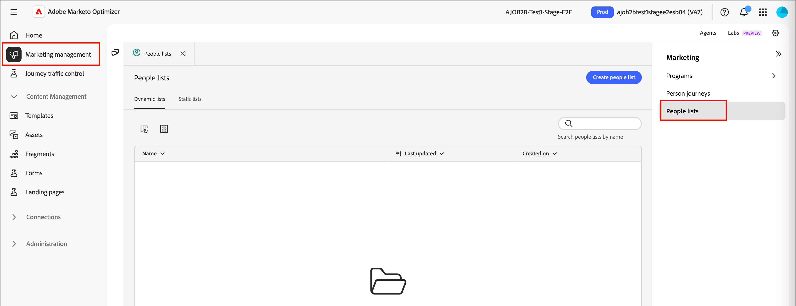

# 人員清單

在[!DNL Adobe Marketo Optimizer]中，人員清單是目標定位和人員歷程專案的人層級對象容器，具有規則型即時資格的動態清單，以及固定或歷程管理成員資格的靜態清單。

## 存取及瀏覽人員清單 {#access-browse}

1. 在左側導覽列中，展開&#x200B;**[!UICONTROL 行銷管理]**。

1. 在&#x200B;**[!UICONTROL 行銷]**&#x200B;資源清單的右側，選取&#x200B;**[!UICONTROL 人員清單]**。

   {width="800" zoomable="yes"}

頁面有兩個標籤，您可以在其中檢視及管理&#x200B;**[!UICONTROL 動態清單]**&#x200B;和&#x200B;**[!UICONTROL 靜態清單]**。 按一下索引標籤，在兩個型別之間切換清單檢視。

您可以在清單頂端的&#x200B;_搜尋_&#x200B;工具中輸入文字，依名稱篩選顯示的清單。 使用清單工具來自訂顯示的清單：

* 按一下&#x200B;_自訂表格_ （）圖示以控制顯示的欄。
* 按一下&#x200B;_重設欄_ （ ）圖示以重設欄寬。

您也可以從此空間：

* 建立新的動態和靜態清單
* 存取清單以檢閱目前的成員資格
* 套用成員資格篩選器

<!--
## Audience Hub

The AI Audience Hub is a centralized, AI-driven starting point for all audience-related capabilities across [!DNL Adobe Marketo Optimizer]. It is designed to accelerate first-time user success while progressively unlocking advanced intelligence, insights, and control for returning and power users.

The Hub acts as:

* A guided starting point for discovering, creating, and refining person lists, account lists, and buying groups

* A visibility layer for audience health, coverage, overlap, engagement patterns, and AI-driven insights

* A control center for audience governance, optimization, reuse, and readiness for activation across journeys and sales workflows

### High level structure

Prompt-based starting point - Quick Start prompts and freeform input to help users discover, create, or optimize audiences.

1. AI insights feed - Surfaces key audience signals such as overlap, gaps, saturation risk, and optimization opportunities.

1. Adaptive audience library - A personalized view of people lists, account lists, and buying groups that adapts based on usage, relevance, and activation.

1. Optimization and arbitration nudges - Guides users to refine, split, or reuse audiences before activation.

1. Audience visibility and reporting - High-level insight into audience health, engagement patterns, and usage across active journeys.

### Empty and Error States (High-Level)

No audiences / no data - Show Quick Start prompts to help first-time users create or import person lists

Low data or incomplete audience - Explain what's missing (e.g., insufficient contacts, missing persona coverage, or low engagement data) and suggest next steps.

AI insights unavailable - Provide a graceful fallback with a clear explanation, so users understand why insights aren't shown and what actions they can take manually.
-->

## 建立人員清單 {#create-people-list}

1. 按一下&#x200B;_[!UICONTROL 人員清單]_&#x200B;頁面右上角的&#x200B;**[!UICONTROL 建立清單]**。

1. 在對話方塊中，選取方案作為清單的&#x200B;**[!UICONTROL 父項]**。

1. 輸入清單的&#x200B;**[!UICONTROL Name]** （必要）和&#x200B;**[!UICONTROL Description]** （選用）。

1. 選擇清單&#x200B;**[!UICONTROL 型別]**：

   * [**[!UICONTROL 靜態]**](#static-lists) — 成員資格取決於您建立清單時所評估的合格篩選器。 除非您手動限定或取消限定記錄，否則清單成員資格不會更新。
   * [**[!UICONTROL 動態]**](#dynamic-lists) — 成員資格由合格篩選器動態決定。 清單成員資格會自動重新整理。

   {width="450"}

1. 按一下&#x200B;**[!UICONTROL 建立]**。

>[!NOTE]
>
>此Beta版本中的人員清單目前不支援刪除和複製。

## 靜態清單 {#static-lists}

靜態清單成員資格是由參照人員屬性和活動的簡單篩選器所定義。 除非您手動讓成員符合資格或取消成員資格，否則成員資格不會變更。

>[!NOTE]
>
>當您新增或移除清單中的成員時，靜態清單篩選定義只會套用一次。 定義的篩選器之後將無法使用。 如果您想要使用篩選器維持一致的對象定義，請改用動態清單。

<!--
What internet says about Marketo static lists -- which of these is also true in Marketo Optimizer?

* Manual Targeting: Storing fixed cohorts, such as attendees of a specific webinar, people who purchased a certain product, or a list of competitors.
* Third-Party Syncing: Allowing external platforms (like Amplitude or Twilio Segment) to automatically sync and export groups of users directly into Marketo as targeted audiences.
* Status Tracking: Helping marketers organize leads into specific categories or track multi-value interests without needing to create new, permanent database fields.List 
* Segmentation: Acting as a reliable, unchanging recipient or suppression list for email campaigns and engagement programs. Unlike a Smart List—which dynamically adds or removes people based on changing criteria or rules—a static list serves as a reliable snapshot. People remain on the list until explicitly added or removed by you or a backend flow.

So far, activating to a destination is the only thing that they are used for that I have found.
-->

### 新增成員 {#static-list-add-members}

1. 開啟靜態清單，然後按一下右上方的&#x200B;**[!UICONTROL 新增人員]**。

1. 在對話方塊中，從左側拖放篩選器，定義用於限定銷售機會的規則。

   您可以使用下列任一組合來篩選人員：

   * 活動歷史記錄
   * 公司屬性
   * 人員屬性
   * 歷程成員資格等特殊篩選器

   針對您新增的每個篩選器，按一下&#x200B;**[!UICONTROL 新增限制]**&#x200B;以調整篩選的符合條件。

   {width="700" zoomable="yes"}

1. 若要儲存變更，請按一下[完成]。**&#x200B;**

1. 選取&#x200B;**[!UICONTROL 成員]**&#x200B;標籤。

   一段時間後，符合資格的成員會出現在清單中。

   靜態清單{width="700" zoomable="yes"}的成員

### 移除成員 {#static-list-remove-members}

1. 開啟靜態清單，然後按一下右上方的&#x200B;**[!UICONTROL 移除人員]**。

1. 在&#x200B;_[!UICONTROL 移除人員]_&#x200B;對話方塊中，新增篩選器以符合您要取消資格的成員。

   {width="700" zoomable="yes"}

1. 若要儲存變更，請按一下[完成]。**&#x200B;**

1. 選取&#x200B;**[!UICONTROL 成員]**&#x200B;標籤。

   經過一段時間後，取消資格的成員會離開清單。

### 啟用至目的地 {#static-list-activate}

當您啟動靜態清單時，它可在下游系統中操作，具有持續同步而不是手動匯出。 這對於付費媒體目標定位、抑制和下游協調非常有用。

* 靜態清單可作為人員的容器。
* 啟用會將該成員資格傳送/同步至目的地。
* 接著，目的地可以對這些人員執行一些動作，例如在LinkedIn上鎖定他們，或從外部對象中移除他們。

因為啟用模式是永久性的，而非一次性匯出：

* 稍後新增至清單的人員會自動傳播。
* 稍後移除的人員會自動停用。
* 行銷人員避免重複CSV匯出和手動上傳。
* 歷程可以隨著時間重新整理對象，以進行持續協調。

>[!PREREQUISITES]
>
>您必須先為您的[!DNL Marketo Optimizer]沙箱設定一或多個[設定目的地](./destinations.md)，才能對目的地啟用靜態清單。

1. 選取&#x200B;**[!UICONTROL 靜態清單]**&#x200B;索引標籤。

1. 找出您要啟用至目的地的靜態清單。

1. 按一下清單旁的&#x200B;_更多功能表_ ( **...** )圖示，然後選擇&#x200B;**[!UICONTROL 啟用至目的地]**。

   ![存取靜態清單的[更多]功能表](./assets/people-lists-static-more-menu.png){width="450"}

   您也可以開啟靜態清單，並使用右上方的&#x200B;_[!UICONTROL 更多]_&#x200B;功能表。

   <!-- which UI is it?  _Activate_ (  ) icon next to the static list name. -->

1. 選取已設定之目的地連線的核取方塊。

   {width="600" zoomable="yes"}

1. 按一下&#x200B;**[!UICONTROL 儲存]**。

1. 按一下&#x200B;**[!UICONTROL 啟用]**，在&#x200B;_[!UICONTROL 啟用清單]_&#x200B;對話方塊中確認啟用。

啟用完成時，會顯示確認訊息（_目的地已啟用。_） 而目的地在清單的&#x200B;**[!UICONTROL 目的地]**&#x200B;標籤上列為&#x200B;**[!UICONTROL 作用中]**。 靜態清單可以一次啟動至多個目的地；成員資格會同步至所有目的地。

若要檢閱啟用靜態清單的目的地，請開啟清單並選取&#x200B;**[!UICONTROL 目的地]**&#x200B;標籤。 依預設，新清單未連線目的地。

#### 停用目的地 {#deactivate-destination}

1. 開啟靜態清單並選取&#x200B;**[!UICONTROL 目的地]**&#x200B;標籤。

1. 按一下您要移除之目的地列上的&#x200B;_減_ ( **-** )圖示。

1. 在&#x200B;_[!UICONTROL 停用目的地]_&#x200B;對話方塊中確認。

停用會將目的地從清單中移除。 清單中的人員也會從連線的目的地對象中移除。

## 動態清單 {#dynamic-lists}

動態清單成員資格是使用參考人員屬性和活動的簡單篩選器來定義。 會根據篩選邏輯，透過限定和取消限定銷售機會來自動維護成員資格。

### 設定成員資格規則 {#set-membership-rules}

1. 開啟動態清單並選取&#x200B;**[!UICONTROL 規則]**&#x200B;標籤。

1. 按一下&#x200B;**[!UICONTROL 編輯規則]**。

   {width="550" zoomable="yes"}

1. 在對話方塊中，從左側拖放篩選器，定義用於限定銷售機會的規則。

   您可以使用下列任一組合來限定銷售機會加入清單：

   * 活動歷史記錄
   * 公司屬性
   * 人員屬性
   * 歷程成員資格等特殊篩選器

   針對您新增的每個篩選器，按一下&#x200B;**[!UICONTROL 新增限制]**&#x200B;以調整篩選的符合條件。

   {width="700" zoomable="yes"}

1. 若要儲存變更，請按一下[完成]。**&#x200B;**

1. 選取&#x200B;**[!UICONTROL 成員]**&#x200B;標籤。

   一段時間後，符合資格的成員會出現在清單中。

   {width="700" zoomable="yes"}

   若要開啟[個人詳細資料](./person-details.md)頁面，您可以在其中檢視摘要和最近的活動，請按一下清單中的個人名稱。

### 複製動態清單 {#duplicate-dynamic-list}

對於動態清單，重複動作類似於複製函式。 使用此函式來復寫成員資格篩選，並將其新增至不同的程式。

1. 在&#x200B;_[!UICONTROL 動態清單]_&#x200B;索引標籤中，按一下清單旁的&#x200B;_更多功能表_ ( **...** )圖示，然後選擇&#x200B;**[!UICONTROL 複製]**。

1. 在對話方塊中，選取重複清單的&#x200B;**[!UICONTROL Parent]**&#x200B;程式。

1. 輸入唯一的&#x200B;**[!UICONTROL Name]** （必要）和&#x200B;**[!UICONTROL Description]** （選用）。

   依照預設，對話方塊會使用附加了`_copy`的原始清單名稱。 視需要為清單輸入不同的唯一名稱。

   {width="375"}

1. 按一下「**[!UICONTROL 重複]**」。
