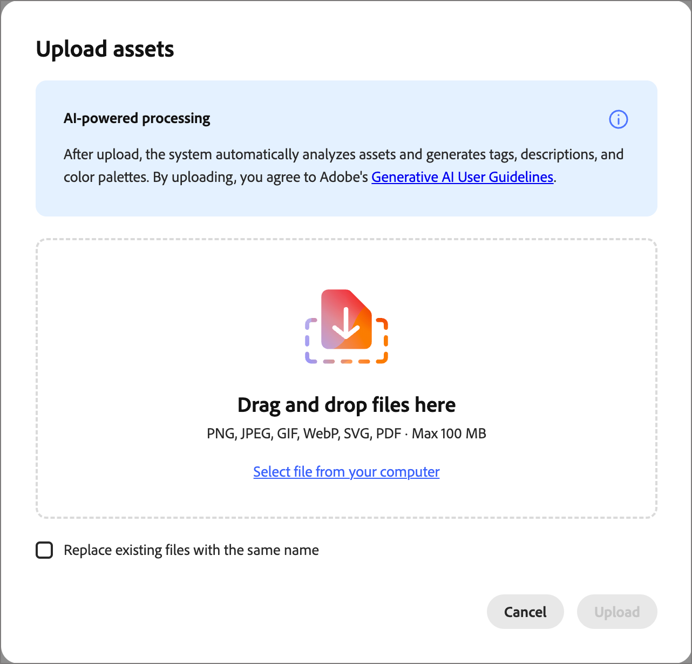
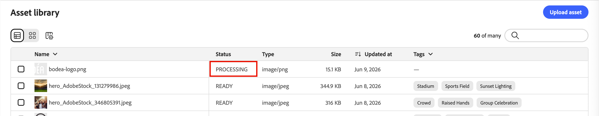

# 資產

在[!DNL Adobe Marketo Optimizer]中，資產通常是設計內容以支援歷程時使用的影像。 您可以在資產選擇器的[電子郵件](email-authoring.md)、[電子郵件範本](templates.md)和[視覺化片段](email-authoring.md#visual-fragments)中使用這些影像，或在視覺化設計空間中使用簡單的拖放介面。

支援的檔案格式：JPG、JPEG、GIF、PNG、EPS、SVG 以及 RGB

<!--

>In this Beta release, you can choose images and assets from a one-time copy of your Marketo Engage asset library directly inside the email canvas. Modifying assets in Marketo Engage after the initial copy is **not** reflected in [!DNL Marketo Optimizer].

-->

>[!NOTE]
>
>您可以從&#x200B;_[!UICONTROL Assets]_&#x200B;資料庫或內容設計空間上傳影像資產。 這些上傳的資產只能在[!DNL Marketo Optimizer]執行個體中使用。
>
>無法從外部系統匯入資產，也無法存取預先填入的資產庫。 預計未來版本將包括從現有系統匯入資產、資料夾支援和擴充的資產管理功能。

<!-- You can [edit these assets using Adobe Express](./image-edit-adobe-express.md), and move them into folders to organize them for use across your emails, templates, and fragments. -->

**Assets**&#x200B;資料庫可讓您存取集中式存放庫，以儲存和管理影像和其他創意資產。 其中包括AI支援的功能，可自動產生中繼資料並啟用自然語言搜尋。

在左側導覽列中，展開&#x200B;**[!UICONTROL 內容管理]**&#x200B;並選取&#x200B;**[!UICONTROL Assets]**。

{width="800" zoomable="yes"}

>[!BEGINSHADEBOX]

第一次存取&#x200B;_[!UICONTROL Assets]_&#x200B;資料庫時，請檢閱[_[!UICONTROL 創作AI使用條款&#x200B;]_](https://www.adobe.com/tw/legal/licenses-terms/adobe-gen-ai-user-guidelines.html)，並確認您的合約。

{width="500"}

>[!ENDSHADEBOX]

程式庫支援兩種版面配置選項：

* **[!UICONTROL 清單]** — 按一下&#x200B;_清單檢視_ （ ）圖示，以使用中繼資料資料欄的可排序表格顯示資產。
* **[!UICONTROL 資產庫]** — 按一下&#x200B;_資產庫檢視_ （）圖示，將資產顯示為視覺縮圖格線。

## 搜尋資產 {#find-assets}

使用&#x200B;_[!UICONTROL 搜尋]_&#x200B;欄位，以自然語言描述您需要的內容來尋找資產。 搜尋結果以AI產生的中繼資料為基礎，因此您不限於依檔案名稱搜尋。

**範例：**

* `team members`
* `nature`
* `exercise`

{width="700" zoomable="yes"}

## 檢視資產詳細資訊 {#view-details}

在清單或資產庫檢視中選取任何資產，以在右側開啟其詳細資料檢視，其中顯示AI產生的說明、標籤、關鍵字和其他中繼資料欄位。 上傳資產時，會自動產生此資訊。 選取&#x200B;**[!UICONTROL AI中繼資料]**&#x200B;標籤以檢閱產生的說明、標籤和中繼資料。

{width="700" zoomable="yes"}

## 上傳資產 {#upload}

1. 按一下右上方的&#x200B;**[!UICONTROL 上傳]**。

1. 在對話方塊中，從本機系統拖放檔案。

   {width="450"}

   或者，您可以按一下[從電腦中選取檔案]&#x200B;**&#x200B;**，使用本機檔案系統來尋找及選取檔案。

1. 按一下&#x200B;**[!UICONTROL 上傳檔案]**&#x200B;以確認並上傳檔案到存放庫。

上傳完成後，系統會自動產生說明、指定標籤和關鍵字，並擷取視覺屬性，例如主旨和設定。 不需要手動標籤。 在此程式完成之前，新影像會以&#x200B;_[!UICONTROL 處理]_&#x200B;狀態顯示。

{width="700" zoomable="yes"}

## 使用資產進行內容製作 {#assets-authoring}

在製作電子郵件、電子郵件範本及視覺片段時使用資產。 視覺內容編輯器可讓您存取&#x200B;_Assets_&#x200B;資料庫中的影像。 您也可以上傳影像資產，將其置於內部資產存放庫中。

您可以在編輯影像元件設定或直接在畫布上選擇影像資產：

* **_空白元件_** — 將影像元件新增至畫布時，該元件為空白，可讓您輕鬆選擇或匯入影像檔案。

  {width="500"}

* **_影像元件工具列_** — 當您在畫布中選取影像元件時，工具列可讓您輕鬆選擇來源並選取影像檔案。

  {width="500"}

* **_影像元件設定_** — 當您在畫布中選取影像元件時，您可以在右側面板中檢視及編輯設定。 若要新增或變更元件中顯示的影像檔案，請選擇來源類型並選取一個影像檔案。

  {width="350"}

按一下「**[!UICONTROL 選取資產]**」以開啟資產選擇器，您可在此從[!DNL Marketo Optimizer]資產存放庫中選擇影像。

{width="700" zoomable="yes"}

您可以使用搜尋和篩選器來找到所需的影像資產。 選取資產並按一下「**[!UICONTROL 選取]**」，以便用作影像元件。

您也可以在結構元件的背景設定中選擇影像資產。
