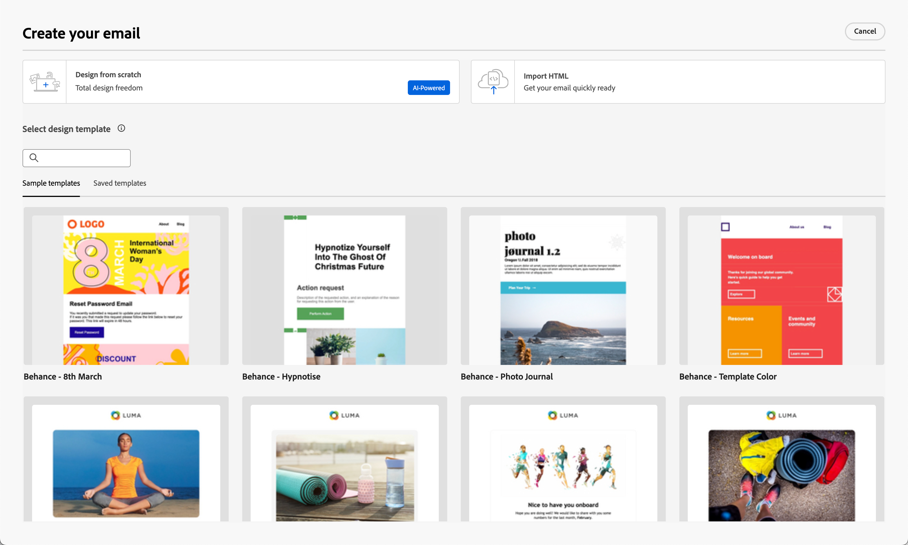
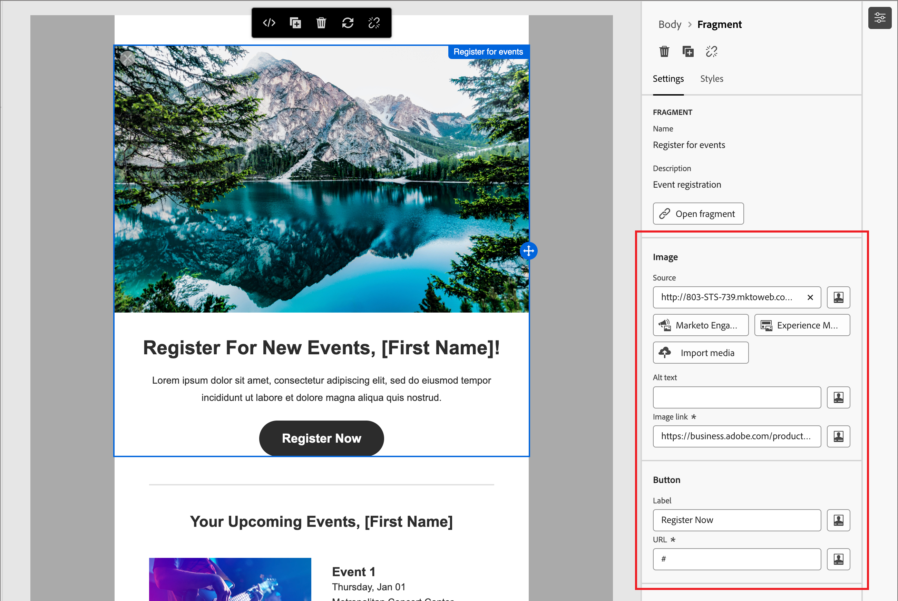

# 電子郵件內容製作

在[!DNL Adobe Marketo Optimizer]中，電子郵件設計空間提供視覺畫布，行銷人員可在其中撰寫電子郵件。 左側和頂端面板中的電子郵件設計工具（結構、內容元件、範本、片段等）支援透過拖放從頭開始建立。 您也可以選擇從範本開始、貼上原始HTML，或從可重複使用的視覺片段組合訊息。

>[!IMPORTANT]
>
>如需子網域的管理員設定、驗證、IP集區和電子郵件通道設定，請參閱[電子郵件傳遞能力](../start/email-deliverability.md)和[電子郵件通道設定](../admin/email-channel-configuration.md)。

在[!DNL Marketo Optimizer]中，每封電子郵件都與人員歷程中的&#x200B;_[!UICONTROL 傳送電子郵件]_&#x200B;動作相關聯。 從歷程設計到電子郵件定義的完整工作流程發生在一個連續的體驗中。 當您[新增&#x200B;_傳送電子郵件_&#x200B;節點](../marketing/action-nodes.md#add-an-action-node)至個人歷程時，請按一下&#x200B;**[!UICONTROL 建立電子郵件]**&#x200B;以開始此程式。 首先，您可以定義電子郵件的動作和內容設定。 按一下「**[!UICONTROL 編輯電子郵件內文]**」以啟動電子郵件內容設計空間，您可以在其中從下列選項中選擇要如何設計電子郵件：

* [使用視覺化設計介面，從草稿開始設計電子郵件](#design-from-scratch)。 在空白畫布上使用拖放功能，透過元件建置電子郵件配置元件。 此方法最適合建立新範本或一次性電子郵件。

* [將現有的HTML內容](#import-html-content)匯入程式碼編輯器或與視覺畫布並排工作。

* [從內建或自訂電子郵件範本清單中選取現有的範本](#templates)。 此方法最適合用於可重複的電子郵件使用案例。

<!-- * Upload a design prototype (JPG, PNG, PDF, or Figma export) and have Coworker convert it into a responsive HTML email. (Image to HTML (Img2HTML) -->

{width="800" zoomable="yes"}

## 電子郵件設計工具 {#email-design-tools}

* **頂端工具列：**&#x200B;儲存、返回、切換到程式碼編輯器、預覽控制項。
* **左側面板：**&#x200B;結構（欄配置）、內容（文字、按鈕、影像、分隔線、社交、HTML）、片段、範本、導覽樹狀結構（電子郵件的DOM樣式階層）。
* **中央畫布：** WYSIWYG編輯器，含案頭和行動裝置預覽。
* **右側面板：**&#x200B;目前所選元件的設定和樣式，包括內容屬性、背景、邊框、邊框間距和個人化。

>[!BEGINSHADEBOX]

## 電子郵件設計最佳實務 {#design-best-practices}

遵循HTML和CSS最佳作法有助於確保跨電子郵件使用者端呈現的一致性。

| 方法 | 指南 |
| -------- | -------- |
| **建議** | 靜態、以表格為基礎的版面配置· HTML表格和巢狀表格·範本寬度600-800畫素·簡單內嵌CSS ·網頁安全字型 |
| **謹慎使用** | 背景影像（有限的使用者端支援） ·自訂Web字型（一律定義後援字型） ·超過800畫素的版面配置·影像地圖 |
| **避免** | JavaScript、iframe或Flash ·內嵌音訊或視訊· HTML表單· Div型版面 |

>[!NOTE]
>
>電子郵件內容也必須符合適用的數位協助工具要求。 以邏輯方式建構標題，為所有影像提供替代文字，並驗證明暗模式下的色彩對比。

>[!ENDSHADEBOX]

## 從頭開始設計您的電子郵件 {#design-from-scratch}

使用視覺內容設計空間來定義電子郵件的結構和內容。 透過使用簡單的拖放動作新增和移動結構元件，您可以在數秒內設計電子郵件內容的版面配置和組織。

1. 從&#x200B;_[!UICONTROL 設計您的電子郵件]_&#x200B;頁面，選取&#x200B;**[!UICONTROL 從草稿開始設計]**&#x200B;選項。

<!-- 

1. In the _[!UICONTROL Create email]_ dialog, choose the type of email content that you want to author.

   * **[!UICONTROL Use Themes]** - Choose this option to create the email in _Theme mode_. In this mode, you can use a defined brand theme to streamline the content authoring process and make sure that the design aligns with defined standards.

   * **[!UICONTROL Manual Styling]** - Choose this option to create the email in _Manual mode_. In this mode, you manually set the styling for all structure and content components that you add to the blank canvas.

-->

1. [在畫布中新增結構和內容元件](#structure-content)。

1. [檢閱和更新連結](#preview-and-edit-linked-urls)。

1. [測試電子郵件](#check-and-test-the-email)。

當您滿意內容時，請按一下[儲存]。**&#x200B;**

## 匯入現有的HTML內容 {#import-html-content}

<!-- originally  from   /help/_includes/content-design-import.md but copied and revised to omit the part about Marketo Engage assets and AEM assets -->

匯入的內容可以是：

* 包含內建樣式表的HTML檔案
* 包含HTML檔案、樣式表(.css)和影像的.zip檔案

  >[!NOTE]
  >
  >.zip 檔案結構沒有限制。 不過，參照必須是相對參照，而且符合.zip資料夾的樹狀結構。 影像一律會上傳至[資產存放庫](./digital-asset-management.md)。

若要匯入包含HTML內容的檔案(_T):_

1. 從設計首頁選取&#x200B;**[!UICONTROL 匯入HTML]**&#x200B;選項。

1. 拖放包含 HTML 內容的 HTML 或 .zip 檔案，然後按一下「**[!UICONTROL 匯入]**」。

{width="500"}

>[!NOTE]
>
>在HTML檔案中使用`<table>`標籤做為第一個圖層可能會造成樣式遺失，包括上層圖層標籤中的背景和寬度設定。

您可以視需要使用視覺化電子郵件編輯器工具個人化匯入的內容。

## 選取範本 {#templates}

當您開啟電子郵件設計空間時，請使用&#x200B;**[!UICONTROL 選取設計範本]**&#x200B;區段，從內建的範例範本或儲存的自訂範本開始。 請參閱[在電子郵件中使用範本](./templates.md#use-in-journey)，以取得完整的工作流程。

>[!NOTE]
>
>儲存的範本可以將治理（內容鎖定）設定套用到一個或多個元件。 當您[從受控制的範本](./template-content-governance.md)撰寫電子郵件時，視覺化設計空間會提供鎖定元件的相關准則。

## 新增結構和內容 {#structure-content}

使用視覺化電子郵件編輯器建置您的電子郵件訊息。 新增預覽文字、使用欄和分隔線來建構版面，然後以內容元件（例如影像、按鈕和文字）填入這些結構。 您也可以套用進階樣式的自訂CSS，以預覽設計在深色模式中的呈現方式。

### 設定預覽文字 {#preheader}

預覽文字是收件匣預覽中主旨行後面顯示的文字片段。 在[!DNL Marketo Optimizer]中，預先標題是在電子郵件設計空間中的視覺畫布上設定，而不是在主旨列旁的電子郵件屬性畫面上。

在左側導覽樹狀結構中選取&#x200B;**[!UICONTROL 內文]**，開啟右側的&#x200B;**[!UICONTROL 設定]**&#x200B;面板。

按一下&#x200B;**[!UICONTROL 預覽文字]**&#x200B;文字區域，然後輸入您的預覽文字副本。 按一下&#x200B;_新增個人化_ （ ）圖示，以使用RTF控制項視需要套用格式設定和[個人化權杖](#personalize-content)。

>[!TIP]
>
>將預覽文字的長度保持在40到100個字元之間。 它應該補充主旨列（不要重複），並提供收件者開啟電子郵件的額外原因。

### 深色模式 {#dark-mode}

透過CSS `prefers-color-scheme`媒體查詢支援深色模式轉譯。 電子郵件設計工具包括深色模式預覽和定義自訂樣式的選項，以支援電子郵件使用者端 — 協助您驗證文字是否仍可讀取、標誌是否可見，以及品牌顏色是否與深色背景一致。

如需預覽、設定自訂深色模式設定、電子郵件使用者端支援及測試最佳作法的詳細指引，請參閱電子郵件內容的[深色模式](./email-dark-mode.md)。

### 新增結構和內容元件 {#components}

將[結構元件](./structure-components.md)和[內容元件](./content-components.md)新增至畫布，建置您的電子郵件配置。

從左側面板的&#x200B;**[!UICONTROL 結構]**&#x200B;和&#x200B;**[!UICONTROL 內容]**&#x200B;區段中拖曳專案，然後在右側的&#x200B;_[!UICONTROL 設定]_&#x200B;和&#x200B;_[!UICONTROL 樣式]_&#x200B;索引標籤中設定每個元件。

### 新增自訂 CSS {#custom-css}

您可以直接在電子郵件設計空間新增自訂CSS，以進行標準元件設定以外的進階樣式。 最佳實務是在包含內容元件（例如影像、按鈕和文字）之前新增此最高層級的樣式。

如需步驟、語法規則和疑難排解，請參閱[為您的內容新增自訂CSS](./design-custom-css.md)。

>[!NOTE]
>
>如果您的電子郵件訊息是使用具有鎖定內容[&#128279;](./template-content-governance.md)的範本設計，則無法將自訂CSS新增至您的內容。 按鈕標籤變更為&#x200B;**[!UICONTROL 檢視自訂CSS]**，而且內容中已存在的任何自訂CSS都是唯讀的。

### 新增片段 {#visual-fragments}

視覺片段是可重複使用的設計元件，可由[!DNL Marketo Optimizer]的多個內容資產參照。 通常是預先建立並快速插入的內容區塊，讓製作更快且更一致。

以下範例概述在製作內容時新增片段的步驟。

1. 若要開啟片段清單，請選取&#x200B;_片段_&#x200B;圖示（  ）。

   您可以：

   * 排序清單。
   * 瀏覽、搜尋或篩選清單。
   * 在縮圖和清單檢視之間切換。
   * 重新整理清單以反映任何最近建立的片段。

   {width="700" zoomable="yes"}

1. 將任何片段拖放至結構元件中。

   編輯器會在電子郵件結構的區段/元素中轉譯片段。

   片段內容會在結構內動態更新，以預覽片段在電子郵件中的呈現方式。

<!-- 
>[!BEGINSHADEBOX]

**Editable fields in customizable fragments**

A visual fragment can include editable fields that you can customize. Custom fields allow you to modify parameters when you incorporate the fragment into your content and create a tailored experience without affecting the original fragment. The fragment author can design the fragment for customization of text, image, and button components. If an included fragment contains components with editable fields, you can change the default values to customize it for your content.

1. Select the fragment component.

   The Settings displayed on the right include editable fields with the default values.

   {width="700" zoomable="yes"}   

1. Change any editable field as needed.

>[!ENDSHADEBOX]
-->

儲存電子郵件後，當您在摘要中選取&#x200B;_[!UICONTROL 使用者]_&#x200B;索引標籤時，它就會顯示在片段詳細資訊頁面中。

### 新增影像資產 {#insert-image}

布建[!DNL Marketo Optimizer]時，現有的Marketo Design Studio資產可在電子郵件設計空間中使用。 您可以直接從資產選擇器瀏覽這些影像，並將其插入您的電子郵件中。

>[!IMPORTANT]
>
>[!DNL Marketo Optimizer]中的資產可用性是根據Marketo Design Studio中&#x200B;**資產的一次性復本**&#x200B;而定。 在初始複製後修改Marketo Engage中的資產&#x200B;**不會**&#x200B;反映在[!DNL Marketo Optimizer]中。 您也可以直接從視覺化設計空間或[Assets資料庫](./digital-asset-management.md)上傳影像資產。

支援的影像檔案型別：

* **完全支援** （顯示在選擇器中，可內嵌的內嵌）：JPG、PNG、GIF、WebP。
* **可存取，但有警告**： SVG （警告部分電子郵件使用者端不會轉譯SVG）。
* **此Beta版本不支援：** TIFF、PDF、DOCX、XLSX、PPTX、CSS、JS、HTML、TXT、二進位檔案、PSD、AI、INDD。

在視覺內容設計空間中，選取左側導覽列中的&#x200B;_Assets_ （  ）圖示。 從資產選擇器中，您可以直接選取儲存在Assets資料庫中的資產。

* 將影像資產拖放至結構元件中，以新增資產。

  {width="800" zoomable="yes"}

* 在畫布上選取現有影像資產，然後按一下影像來源工具中的&#x200B;**[!UICONTROL 選取資產]**，即可取代現有影像資產。

  {width="600" zoomable="yes"}

如需有關使用資產的詳細資訊，請參閱&#x200B;[_使用資產進行內容製作_](./digital-asset-management.md#assets-authoring)。

### 導覽圖層、設定和樣式 {#navigation-layers}

使用導覽樹狀結構來選取元件和欄，然後在右側面板中調整其設定和樣式。 請參閱[導覽樹狀結構](./structure-components.md#navigation-tree)。

### 將內容個人化 {#personalize-content}

[!DNL Marketo Optimizer]使用Handlebars語法進行個人化。 Token在傳送時會取代為每個收件者設定檔資料的值。 您可在多個位置在電子郵件中使用個人化：

* **主旨列** — 最常見的個人化點。
* **Preheader** — 設定於視覺畫布內；支援設定檔屬性Token。
* **電子郵件內文文字** — 名字和其他設定檔屬性插入內嵌。
* **按鈕URL** — 附加每個收件者引數。

>[!NOTE]
>
>在此Beta版本中，Personalization編輯器中只能使用設定檔屬性。

新增個人化&#x200B;:_(_T)

1. 在電子郵件設計空間（或主題行的電子郵件屬性頁面上）中，按一下您要插入代號的欄位。
1. 按一下「_個人化_」（「」）圖示以使用個人化權杖。
1. 在個人化對話方塊中，瀏覽左側的架構樹狀結構。 列出設定檔屬性（名字、姓氏、電子郵件、職稱和其他設定檔欄位）。
1. 選取屬性。 編輯器會插入對應的Handlebars運算式，例如`{{profile.firstName}}`。
1. 新增遞補值以處理遺漏的資料： `{{profile.firstName | default: "there"}}`。
1. 按一下&#x200B;**[!UICONTROL 確認]**&#x200B;或&#x200B;**[!UICONTROL 插入]**。 運算式會內嵌顯示於欄位中。

+++通用個人化模式{#personalization-patterns}

使用Handlebars運算式，例如下列（個人化使用[個人化內容](#personalize-content)中說明的相同語法）：

* `{{profile.lastName}}` — 插入收件者的姓氏。
* `{{profile.jobTitle}}` — 在正文復本中參考收件者的職稱。
* `{{profile.firstName}}, ready to take the next step?` — 結合語彙基元與靜態文字內嵌。

對於缺少值時具有遞補的名字問候語，請使用先前個人化步驟中所顯示的`default`協助程式（例如，具有預設`"there"`的名字）。

+++

+++Handlebars協助程式{#handlebars-helpers}

除了`default`，個人化編輯器還包含用於條件式邏輯、文字轉換和日期格式的內建Handlebars協助程式。 使用編輯器的函式瀏覽器來探索可用的協助程式，並以正確的語法插入它們。

>[!TIP]
>
>在電子郵件設計空間中，直接在任何文字欄位中輸入`{{`以觸發內嵌自動完成下拉式清單，列出可用的設定檔屬性 — 不需要開啟完整的個人化對話方塊即可快速插入。

+++

+++AI輔助運算式{#ai-personalization}

個人化編輯器中的Co-worker可從純語言說明產生Handlebars運算式、說明現有運算式的功能，並識別潛在問題。 使用它可以加速運算式編寫，尤其是條件式邏輯或日期格式協助程式。

+++

如需運算式編輯器工具和語法的詳細資訊，請參閱[Personalization運算式](./personalization-expressions.md)。

### 編輯連結的URL追蹤 {#preview-and-edit-linked-urls}

{{$include /help/_includes/content-design-links.md}}

## 檢查和測試電子郵件 {#check-and-test-the-email}

使用電子郵件設計空間工具列中的案頭和行動裝置預覽控制項，在儲存前檢閱您的電子郵件配置。 切換到深色模式預覽，以驗證可讀性和對比（請參閱電子郵件內容的[深色模式](./email-dark-mode.md)）。

此Beta版本中無法使用測試設定檔、[!UICONTROL 模擬內容]和傳送校樣工作流程。 請參閱電子郵件通道概觀中的[目前限制](../marketing/email-channel.md#limitations)。

檢閱[驗證電子郵件內容](#validation)，以取得您必須在歷程啟用之前解決的內容警示。

## 驗證電子郵件內容 {#validation}

您必須先將電子郵件內容設為有效，才能啟用您的歷程。 [!DNL Marketo Optimizer]會在電子郵件和歷程畫布上顯示內容層級警示。 本節涵蓋您可能會看到的警示以及如何解決這些警示。

### 常見內容警示 {#content-alerts}

| 警報 | 其含義 | 如何解決 |
| ----- | ------------- | -------------- |
| **主旨列遺失** | 主旨行欄位是空的。 | 開啟電子郵件並在&#x200B;**[!UICONTROL Content]**&#x200B;索引標籤上輸入主旨列。 允許Personalization權杖，但欄位不得為空白。 |
| **電子郵件內文是空的** | 電子郵件設計空間中的畫布沒有內容。 | 按一下&#x200B;**[!UICONTROL 編輯電子郵件內文]**&#x200B;以開啟電子郵件設計空間。 將至少一個結構和一個內容元件拖曳到畫布上，然後按一下「儲存」。 |
| 未選取&#x200B;**頻道設定** | 尚未為電子郵件節點選擇電子郵件通道設定。 | 在&#x200B;**[!UICONTROL 動作]**&#x200B;索引標籤上，選取使用中的&#x200B;**[!UICONTROL 電子郵件通道設定]**。 |
| **管道設定已刪除** | 先前選取的管道設定已刪除或不再有效。 | 在&#x200B;**[!UICONTROL 動作]**&#x200B;索引標籤上，選取其他作用中的&#x200B;**[!UICONTROL 電子郵件通道設定]**。 如果沒有可用的專案，系統管理員必須在[電子郵件通道設定](../admin/email-channel-configuration.md)中建立或重新啟用一個專案。 |
| **電子郵件大小超過100 KB** | 總電子郵件大小（HTML、內嵌CSS、編碼內容）大於100 KB ISP最佳實務上限。 | 縮小電子郵件大小：以Marketo Design Studio中的外部託管影像取代大型內嵌影像、移除未使用的內嵌CSS、簡化巢狀結構。 |
| **未解析的個人化權杖** | Handlebars權杖參照沒有遞補的設定檔屬性，而且某些收件者可能遺漏屬性。 | 使用Handlebars `default`協助程式新增遞補，如[個人化內容](#personalize-content)中所述。 或者，將歷程對象限製為保證屬性的設定檔。 |
| **未載入影像** | 影像元件會參照無法再使用的資產。 | 按一下影像，開啟資產選擇器，然後從Assets資料庫中重新選取資產。 |
