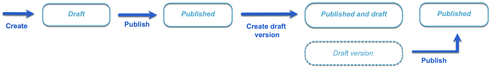
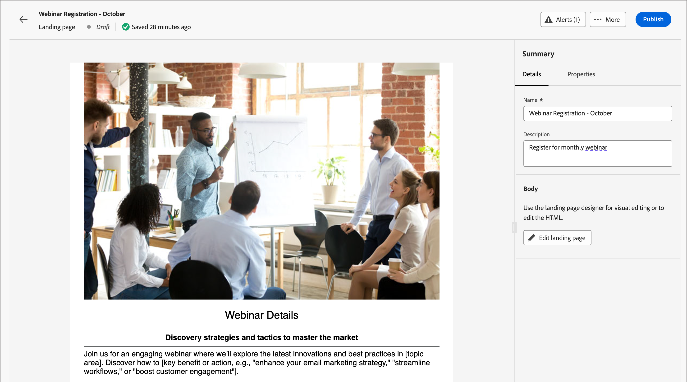
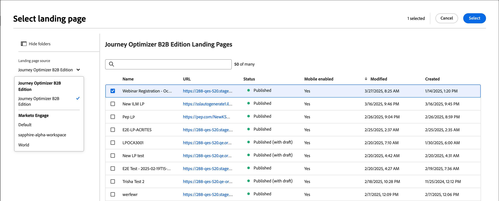

# 登陸頁面

登入頁面是獨立的網頁，您可以在聯絡人和客戶點按電子郵件、簡訊或任何數位位置中的連結專案後，指引他們。 您可以將這些頁面併入您的歷程，讓潛在客戶和客戶在網頁上檢視您的訊息，並在您的歷程中前進。

登入頁面的常見使用案例：

* 提供加入或退出行銷通訊或特定服務。 在電子郵件或其他通訊中使用指向目標清單的連結。
* 在傳送通訊之前收集同意，並在選擇加入或選擇退出時傳送確認電子郵件。
* 使用登入頁面上的表單來擷取或更新設定檔資料（漸進式設定檔、偏好設定、註冊和類似案例）。
* 將人們引導至專為您的歷程協調設計的行銷活動特定資訊。
* 將使用者重新導向至專用網路表單，而不需在[!DNL Marketo Optimizer]外部建立外部頁面。

## 登陸頁面工作流程 {#workflow}

若要在歷程對象成員按一下特定連結時，將他們導向至已定義的網頁，請在[!DNL Marketo Optimizer]中建立登陸頁面：

1. [建立頁面](./landing-pages-create-publish.md#create-landing-page) — 選取預設集、設定主要頁面，並新增任何必要的子頁面。
1. [設計登入頁面內容](./landing-page-design.md) — 使用拖放視覺化設計元件來建置頁面內容。
1. [測試登入頁面](./landing-pages-create-publish.md#test-landing-page) — 預覽頁面並測試表單行為。
1. [發佈登入頁面](./landing-pages-create-publish.md#publish-landing-page) — 發佈讓頁面上線並可供連結。
1. [從您的歷程連結至頁面](#link-to-landing-page) — 將登入頁面URL新增至電子郵件、簡訊或歷程動作，讓收件者可以存取。

例如，您可以建立並設計登入頁面，將使用者導向至線上資訊。 頁面可能包含他們可以選擇加入或選擇退出接收您通訊的表單。 或者，您也可以藉此機會訂閱定期通訊，例如電子報。

## 存取及管理登入頁面 {#access-manage-landing-pages}

若要存取[!DNL Marketo Optimizer]中的登入頁面，請移至左側導覽並展開&#x200B;**[!UICONTROL 內容管理]**。 然後選取&#x200B;**[!UICONTROL 登陸頁面]**。 此動作會顯示執行個體中建立的所有登入頁面清單。

{width="800" zoomable="yes"}

此清單是根據&#x200B;_[!UICONTROL 已修改]_&#x200B;欄排序，最近更新的專案位於頂端。 按一下欄標題，在升序和降序之間變更。

### 篩選登入頁面清單 {#filter-list}

若要依名稱搜尋登入頁面，請在搜尋列中輸入文字字串以尋找相符專案。 按一下&#x200B;_篩選器_&#x200B;圖示（）以顯示可用的篩選器選項，並變更設定以根據您指定的條件篩選顯示的專案。

{width="800" zoomable="yes"}

<!-- 
This is going away? ### Customize the column display

Customize the columns that you want to display in the table by clicking the _Customize table_ icon (  ) at the top right. 

In the dialog, select the columns to display and click **[!UICONTROL Apply]**.

{width="300"} 
-->

### 登陸頁面狀態和生命週期 {#landing-page-status}

登入頁面狀態會決定其是否可用於您的電子郵件和簡訊內容中的連結，以及您可以對其進行的變更。

| 狀態 | 說明 |
| -------------------- | ----------- |
| 草稿 | 建立登入頁面時，其狀態為草稿。 當您定義或編輯視覺內容時，它會保持此狀態，直到您將其發佈為託管頁面為止。 可用的動作：  <ul><li>編輯名稱或說明</li><li>編輯連結網址</li><li>在視覺設計空間編輯</li><li>發佈</li><li>重複</li><li>刪除</li></ul> |
| 發佈日期 | 當您發佈登入頁面時，此頁面託管於[!DNL Marketo Optimizer]執行個體，且可在電子郵件或簡訊內容中用於連結。 可用的動作：  <ul><li>編輯名稱或說明</li><li>編輯連結網址</li><li>在電子郵件或簡訊內容中新增連結</li><li>建立草稿版本</li><li>重複</li><li>刪除</li></ul> |
| 已與草稿一起發佈 | 當您從已發佈的登陸頁面建立草稿時，已發佈的版本會保留，而且草稿內容可以在視覺設計空間中進行修改。 如果您發佈草稿版本，草稿版本會取代目前發佈的版本，且託管頁面中的內容會更新。 可用的動作：  <ul><li>編輯名稱或說明</li><li>編輯連結網址</li><li>在電子郵件或簡訊內容中新增連結</li><li>在視覺化設計空間中編輯草稿版本</li><li>發佈草稿版本</li><li>重複</li><li>刪除（刪除兩個版本）</li><li>捨棄草稿（返回已發佈狀態）</li></ul> |

{zoomable="yes"}

## 編輯登入頁面 {#edit-landing-page}

對登入頁面的編輯取決於其目前狀態：

* 當登入頁面處於&#x200B;**_草稿_**&#x200B;狀態時，您可以編輯其任何詳細資料、URL和視覺內容。
* 當登入頁面處於&#x200B;**_已發佈_**&#x200B;狀態時，您可以編輯說明，但不能編輯名稱。 若要變更視覺內容，您必須建立頁面的草稿版本。
* 當登入頁面處於&#x200B;**_以草稿_**&#x200B;狀態發佈時，編輯詳細資料僅限於說明。 您也可以編輯草稿版本的視覺內容。

>[!BEGINTABS]

>[!TAB 草稿]

1. 從&#x200B;_[!UICONTROL 登入頁面]_&#x200B;清單頁面，按一下登入頁面名稱以開啟。

   接著會顯示視覺內容的預覽，登陸頁面的詳細資訊位於右側。

1. 修改任何詳細資訊，例如名稱和說明。

   {width="700" zoomable="yes"}

1. 若要變更視覺化設計空間中的內容，請按一下&#x200B;**[!UICONTROL 編輯登陸頁面]**。

   視需要使用視覺化設計工具：

   * [新增結構和內容](./landing-page-design.md#structure-content-landing-page)
   * [新增資產](./landing-page-design.md#add-assets)
   * [導覽圖層、設定和樣式](./landing-page-design.md#navigate-layers-settings-styles)
   * [將內容個人化](./landing-page-design.md#personalize-content)
   * [編輯連結的URL追蹤](./landing-page-design.md#linked-url-tracking)

1. 按一下「**[!UICONTROL 儲存]**」，或「**[!UICONTROL 儲存並關閉]**」以返回登陸頁面的詳細資料。

1. 當頁面符合您的條件且您想要可供顯示時，請按一下&#x200B;**[!UICONTROL 發佈]**。

>[!TAB 已發佈]

1. 從&#x200B;_[!UICONTROL 登入頁面]_&#x200B;清單頁面，按一下頁面名稱以開啟。

   接著會顯示視覺內容的預覽，登陸頁面的詳細資訊位於右側。

1. 視需要修改說明。

   針對已發佈的登陸頁面，無法變更所有其他詳細資料。

1. 若要更新內容，請按一下右側的&#x200B;**[!UICONTROL 編輯登陸頁面]**。

   在對話方塊中按一下&#x200B;**[!UICONTROL 建立草稿版本]**，在視覺化設計空間開啟草稿版本。

   視需要使用視覺化設計工具：

   * [新增結構和內容](./landing-page-design.md#structure-content-landing-page)
   * [新增資產](./landing-page-design.md#add-assets)
   * [導覽圖層、設定和樣式](./landing-page-design.md#navigate-layers-settings-styles)
   * [將內容個人化](./landing-page-design.md#personalize-content)
   * [編輯連結的URL追蹤](./landing-page-design.md#linked-url-tracking)

1. 按一下「**[!UICONTROL 儲存]**」，或「**[!UICONTROL 儲存並關閉]**」以返回登陸頁面的詳細資料。

1. 當草稿登入頁面符合您的條件，而您想要讓變更可在已發佈的頁面上使用時，請按一下&#x200B;**[!UICONTROL 發佈]**。

   當您發佈草稿版本時，它會取代目前發佈的版本，並更新頁面URL的內容。

>[!TAB 已發佈草稿]

當您開啟登入頁面時，會顯示草稿版本。 預覽空間頂端的索引標籤可讓您在已發佈版本和草稿版本之間切換顯示。 草稿動作和詳細資訊會顯示在右側。

{width="700" zoomable="yes"}

更新內容&#x200B;:_(_T)

1. 按一下右上方的&#x200B;**[!UICONTROL 編輯登陸頁面]**。 視需要使用視覺化設計工具：

   * [新增結構和內容](./landing-page-design.md#structure-content-landing-page)
   * [新增資產](./landing-page-design.md#add-assets)
   * [導覽圖層、設定和樣式](./landing-page-design.md#navigate-layers-settings-styles)
   * [將內容個人化](./landing-page-design.md#personalize-content)
   * [編輯連結的URL追蹤](./landing-page-design.md#linked-url-tracking)

1. 按一下「**[!UICONTROL 儲存]**」，或「**[!UICONTROL 儲存並關閉]**」以返回登陸頁面的詳細資料。

1. 當草稿頁面符合您的條件且您想要讓變更可用時，請按一下[發佈]。****

   當您發佈草稿版本時，草稿版本會取代目前發佈的版本，而託管頁面中的內容會更新。

>[!ENDTABS]

## 複製登陸頁面 {#duplicate-landing-page}

您可以使用下列其中一種方法來複製登入頁面：

* 從&#x200B;_[!UICONTROL 登陸頁面]_&#x200B;清單頁面，按一下&#x200B;_更多_&#x200B;圖示(**...**) 在登入頁面名稱旁邊，並選擇&#x200B;**[!UICONTROL 複製]**。
* 在登入頁面詳細資訊頁面的右上方，按一下&#x200B;**[!UICONTROL ...更多]**&#x200B;並選擇&#x200B;**[!UICONTROL 複製]**。

{width="600" zoomable="yes"}

在對話方塊中，輸入有用的名稱（唯一）和說明（選擇性）。 按一下&#x200B;**[!UICONTROL 複製]**&#x200B;以完成動作。

{width="350"}

然後，重複的（新）頁面會出現在&#x200B;_登陸頁面_&#x200B;清單中。

## 刪除登陸頁面 {#delete-landing-page}

您可以使用下列其中一種方法來刪除登入頁面：

* 從&#x200B;_[!UICONTROL 登陸頁面]_&#x200B;清單頁面，按一下&#x200B;_更多_&#x200B;圖示(**...**) 在登入頁面名稱旁邊，並選擇&#x200B;**[!UICONTROL 刪除]**。
* 在登入頁面詳細資訊頁面的右上方，按一下&#x200B;**[!UICONTROL ...更多]**&#x200B;並選擇&#x200B;**[!UICONTROL 刪除]**。

此動作會開啟確認對話方塊。 您可以按一下&#x200B;**[!UICONTROL 取消]**，或按一下&#x200B;**[!UICONTROL 刪除]**&#x200B;確認刪除，以中止程式。

{width="400"}

## 連結至登入頁面 {#link-to-landing-page}

作為產生電子郵件、片段和頁面內容的行銷人員或創意人員，您可以內嵌連結至在您的[!DNL Marketo Optimizer]執行個體中建立的已發佈（即時）登陸頁面。

1. 當您在片段、電子郵件、登入頁面或範本的視覺設計空間工作時，請為連結選取文字片段、按鈕元件或影像元件。

   **[!UICONTROL 連結]**&#x200B;選項會顯示在右側面板中。

1. 針對&#x200B;**[!UICONTROL Type]**&#x200B;選項，請選擇&#x200B;**[!UICONTROL 登陸頁面]**。

   登陸頁面的{width="700" zoomable="yes"}

1. 針對&#x200B;**[!UICONTROL 登陸頁面]**&#x200B;選項，按一下&#x200B;_選取頁面_&#x200B;圖示（ ）。

1. 在「選取登陸頁面」對話方塊中，將&#x200B;**[!UICONTROL 登陸頁面來源]**&#x200B;設定為&#x200B;**[!UICONTROL Journey Optimizer B2B edition]**，從已發佈頁面的清單中選取登陸頁面的核取方塊，然後按一下「選取&#x200B;**[!UICONTROL 」]**。

   登陸頁面的{width="600" zoomable="yes"}

1. 針對&#x200B;**[!UICONTROL Target]**&#x200B;選項，選擇連結目標行為：

   * **[!UICONTROL 無]** — 使用瀏覽器預設行為開啟連結。
   * **[!UICONTROL 空白]** — 在新視窗或索引標籤中開啟連結。
   * **[!UICONTROL Self]** — 在相同框架中開啟連結。
   * **[!UICONTROL 父系]** — 在父框架中開啟連結。
   * **[!UICONTROL Top]** — 在視窗的整個內文中開啟連結。

1. （僅限文字連結）如果要將連結的文字加底線，請選取&#x200B;**[!UICONTROL 加底線連結]**&#x200B;核取方塊。

   您可以選取右側面板中的&#x200B;**[!UICONTROL 樣式]**&#x200B;索引標籤，為連結文字設定其他樣式，包括連結顏色。
