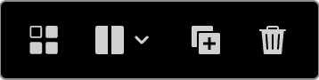
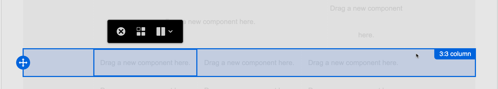

# 結構元件 {#structure-components}

>[!CONTEXTUALHELP]
>id="ajo-b2b-prime_structure_components_email"
>title="關於結構元件"
>abstract="結構元件是指設計電子郵件結構時可以使用的版面配置元素。"

>[!CONTEXTUALHELP]
>id="ajo-b2b-prime_structure_components_landing_page"
>title="關於結構元件"
>abstract="結構元件是指設計頁面結構時可以使用的版面配置元素。"

>[!CONTEXTUALHELP]
>id="ajo-b2b-prime_structure_components_fragment"
>title="關於結構元件"
>abstract="結構元件是指設計片段結構時可以使用的版面配置元素。"

>[!CONTEXTUALHELP]
>id="ajo-b2b-prime_structure_components_template"
>title="關於結構元件"
>abstract="結構元件是指設計範本結構時可以使用的版面配置元素。"

使用視覺設計空間中的&#x200B;_結構元件_&#x200B;來定義內容的結構。 透過使用簡單的拖放動作新增和移動結構元素，您可以快速定義內容配置的形狀。 每個結構元件橫跨水準空間，您可以棧疊它們以垂直建置版面。<!-- Divide each component into columns to form each content block that you need, then add [content components](./content-components.md) inside them to populate the layout. -->

## 結構程式庫 {#structure-library}

在&#x200B;_[!UICONTROL Components]_&#x200B;程式庫的頂端，**[!UICONTROL Structures]**&#x200B;區段會顯示可用的結構元件：

| 圖示 | 元件 | 說明 |
| ----- | ----------- | ----------- |
|  | [!UICONTROL 1:1資料行] | 填滿空格寬度的單一欄容器。 |
|  | [!UICONTROL 1:2資料行左側] | 一種兩欄式容器，使用1:2的比率來填滿空間的寬度。 第一（左）欄佔據三分之一的寬度，第二（右）欄佔據其餘的三分之二。 |
|  | [!UICONTROL 1:3資料行靠左] | 一種兩欄式容器，使用1:3的比率來填滿空間的寬度。 第一（左）欄佔據四分之一的寬度，第二（右）欄佔據其餘四分之三。 |
|  | [!UICONTROL 2:1資料行靠右] | 一種兩欄式容器，使用2:1的比率來填滿空間的寬度。 第一（左）欄佔據寬度的三分之二，第二（右）欄佔據其餘的三分之一。 |
|  | [!UICONTROL 2:2資料行] | 一種兩欄式容器，使用2:2的比率來填滿空間的寬度。 左欄和右欄的寬度相等。 |
|  | [!UICONTROL 3:1資料行靠右] | 兩欄式容器，使用3:1的比率來填滿空間的寬度。 第一（左）欄佔據寬度的四分之三(75%)，第二（右）欄佔據剩餘的四分之一(25%)。 |
|  | [!UICONTROL 3:3資料行] | 三欄式容器，使用3:3的比率來填滿空間的寬度。 三欄的寬度相等。 |
|  | [!UICONTROL 4:4資料行] | 四欄式容器，使用4:4的比率來填滿空間的寬度。 所有四欄的寬度相等。 |
|  | [!UICONTROL n:n欄] | 可自訂的欄結構，會根據您定義的欄填滿空間。 您可以設定欄數（介於2到10之間），並個別設定每欄的寬度。 [了解更多](#change-nn-columns) |

## 新增結構元件 {#add-structure-components}

當您為電子郵件、登入頁面或片段設計內容時，請新增每個結構元件以建構版面。 從左側的&#x200B;**[!UICONTROL Structures]**&#x200B;區段拖曳一個專案，然後將其放到畫布上。 您可以使用工具列來選取欄，並使用右側面板上的&#x200B;_設定_&#x200B;和&#x200B;_樣式_&#x200B;索引標籤來定義所選元件或欄的引數。

{width="800" zoomable="yes"}

### 元件工具列 {#component-toolbar}

當您在畫布中選取工具列時，該工具列會顯示在畫布中。 可用的工具可讓您輕鬆選取欄並套用元件函式。

{width="150"}

| 工具 | 名稱 | 使用情況 |
| ---- | ---- | ----- |
| {width="40"} | 啟用條件式內容 | （電子郵件和片段）啟用元件的條件變體。 |
| {width="100"} | 選取欄 | 依數字選取欄。 選取欄時，您可以套用欄設定和樣式。 |
| {width="40"} | 重複 | 建立元件的復本，並直接將其新增到下方。 |
| {width="40"} | 刪除 | 移除元件。 |

### 元件設定 {#component-settings}

新增元件後，會在視覺設計空間選取元件，其屬性會顯示在右側面板中。 預設會顯示&#x200B;_[!UICONTROL 設定]_&#x200B;標籤。 您也可以隨時選取結構元件以變更設定。

#### 顯示選項

若要從案頭或行動裝置顯示中排除元件，請變更&#x200B;**[!UICONTROL 顯示選項]**&#x200B;設定。 預設值&#x200B;_[!UICONTROL 在所有裝置上顯示]_，可跨所有裝置顯示。

{width="400" zoomable="yes"}的選項

選擇其他設定以依裝置型別排除元件：

* _[!UICONTROL 僅在桌上型裝置上顯示]_ — 當您想要在桌上型裝置上顯示元件，並將它排除在行動裝置上時，請選擇此設定。
* _[!UICONTROL 僅在行動裝置上顯示]_ — 當您想要在行動裝置（例如手機和平板電腦）上顯示元件時，請選擇此設定，並將它排除在桌上型裝置之外。

#### 頁首與頁尾

您可以在電子郵件訊息或登入頁面中，將結構元件指定為HTML頁首或頁尾。 在畫布中選取結構元件後，按一下&#x200B;**[!UICONTROL 頁首]**&#x200B;或&#x200B;**[!UICONTROL 頁尾]**&#x200B;選項。 只能有一個頁首或頁尾，如果指派了另一個元件，則選項不可用。

{width="600" zoomable="yes"}

您可以選取元件並按一下選項來移除表頭或表尾指定。

### 棧疊欄 {#stacked-columns}

對於較小的熒幕或顯示視窗，除非您變更預設設定，否則結構元件中的欄會顯示為棧疊。 選取多欄結構元件後，將切換滑桿向右移動，變更&#x200B;**[!UICONTROL 不要棧疊行動裝置上的欄]**&#x200B;設定。

{width="250"}

## 元件樣式 {#component-styles}

新增元件後，會在視覺設計空間選取元件，其屬性會顯示在右側面板中。 您也可以隨時選取元件以變更設定和樣式。

### 背景 {#background}

在右側面板中選取&#x200B;_[!UICONTROL 樣式]_&#x200B;索引標籤後，請使用&#x200B;**[!UICONTROL 背景]**&#x200B;區段來定義顏色和選用的影像，以做為結構元件的背景。

#### [!UICONTROL 背景顏色]

選取核取方塊，然後按一下顏色方塊，從選擇器中選擇顏色。 您可以輸入已知的RGB、HSL、HSB或十六進位值來選擇顏色。 或者，使用顏色滑桿和顏色欄位來選取顏色。

{width="300"}

#### [!UICONTROL 背景影像] {#background-image}

移動切換選取器以啟用背景影像設定。

{width="250"}

按一下「**[!UICONTROL 選取資產]**」以開啟資產選擇器，您可在此從[Assets資料庫](./digital-asset-management.md#assets-authoring)中選擇影像。

使用&#x200B;**[!UICONTROL 影像位置]**&#x200B;選項來選擇影像填滿結構元件的方式。 位置設定遵循標準[HTML背景影像填色和對齊屬性](https://www.w3schools.com/html/html_images_background.asp){target="_blank"}。

{width="250"}

### 其他樣式 {#other-styles}

您可以套用其他結構元件樣式，以調整其在電子郵件訊息或登入頁面中的顯示。 若需這些內建選項以外的樣式，請參閱[為您的內容新增自訂CSS](./design-custom-css.md)。

+++邊框

{{styles-border}}

+++

+++邊距

{{styles-margin}}

+++

+++進階

{{styles-advanced}}

+++

## 欄 {#columns}

使用元件工具列中的&#x200B;_選取資料行_&#x200B;工具來選取資料行。 然後，您可以使用欄工具列來變更欄選擇、移除欄，或為欄套用條件式內容變體。 資料行的引數會顯示在右側的&#x200B;_[!UICONTROL 設定]_&#x200B;和&#x200B;_[!UICONTROL 樣式]_&#x200B;標籤中。

{width="500"}

| 工具 | 名稱 | 使用情況 |
| ---- | ---- | ----- |
| — | 清除欄 | 清除欄中的內容。 請參閱欄工具列中的第一個工具。 |
| {width="40"} | 啟用條件式內容 | （電子郵件和片段）啟用欄的條件變體。 |
| {width="100"} | 選取欄 | 依數字選取欄。 選取欄時，您可以套用設定和樣式。 |

### 變更n:n欄 {#change-nn-columns}

大多數結構元件的欄寬是靜態的。 新增&#x200B;_[!UICONTROL n:n欄]_&#x200B;元件時，您可以變更欄數和欄大小。 n:n欄元件以五欄等寬(20%)開始。

>[!NOTE]
>
>每個欄大小不能小於結構元件總寬度的10%。 只能移除空白欄。

在畫布中選取元件後，使用右側面板中的&#x200B;**[!UICONTROL 欄數]**&#x200B;選項來變更欄數。 按一下向上和向下箭頭圖示以增加或減少欄數，或在欄位中輸入數字。

{width="650" zoomable="yes"}

在畫布中，移動欄大小圖示以調整所選欄的寬度。 當您增加或減少寬度時，相鄰的欄也會調整，讓所有欄都佔據100%的元件寬度。

{width="500" zoomable="yes"}

### 欄樣式 {#column-styles}

在畫布中選取欄後，您可以設定樣式以套用至該欄。

+++背景

* **[!UICONTROL 背景顏色]** — 選取核取方塊，然後按一下顏色方塊，從選擇器中選擇顏色。 您可以輸入已知的RGB、HSL、HSB或十六進位值來選擇顏色。 或者，您可以使用顏色滑桿和顏色欄位來選取顏色。

  {width="300"}

* **[!UICONTROL 背景影像]** — 移動切換選擇器以啟用背景影像設定。

  樣式面板中的{width="250"}

  選擇資產來源型別，並[選取影像檔](#background-image)。

+++

+++邊框

{{styles-border}}

+++

+++對齊方式

{{styles-alignment-v}}

+++

+++邊距

{{styles-margin}}

+++

+++進階

{{styles-advanced}}

+++

## 導覽樹狀結構 {#navigation-tree}

在視覺化設計空間中，您可以使用導覽樹來存取結構元件，包括欄和內容。 按一下左側的&#x200B;_[!UICONTROL 導覽樹狀結構]_&#x200B;圖示（）以顯示樹狀結構。

{width="800" zoomable="yes"}

_[!UICONTROL Body]_&#x200B;元素是樹狀結構的根目錄。 按一下樹狀結構中的任何元件或欄子元素，以在畫布上選取它。 右側的&#x200B;_[!UICONTROL 設定]_&#x200B;和&#x200B;_[!UICONTROL 樣式]_&#x200B;索引標籤會顯示該元件或資料行的引數。

在視覺化設計空間中顯示的{width="800" zoomable="yes"}
