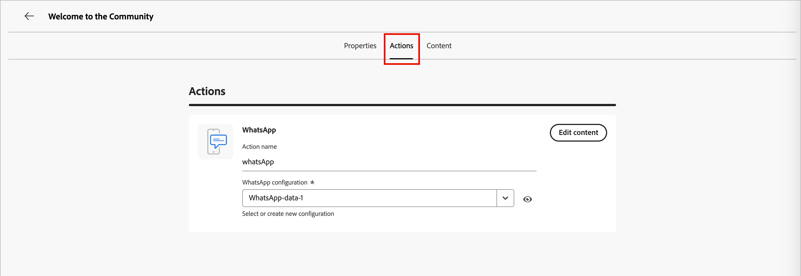

# WhatsApp製作

使用[!DNL Adobe Marketo Optimizer]將WhatsApp訊息傳送給行動裝置上的使用者。 您可以使用WhatsApp編輯器提供的已核准Meta訊息範本，建立、個人化和預覽訊息。

在為個人歷程建立WhatsApp訊息之前，請確定您已在&#x200B;_[!UICONTROL 管理員]_&#x200B;設定中設定[WhatsApp頻道](../admin/configuration-channels-whatsapp.md)。

>[!NOTE]
>
>[!DNL Marketo Optimizer]只支援&#x200B;_傳出_&#x200B;個WhatsApp訊息元素。

+++ 支援的訊息元素和call-to-action選項

請使用此區段中的表格，作為您可在已核准Meta範本中納入的傳出WhatsApp內容，以及可新增至訊息的互動式按鈕的參考。

下表摘要支援的訊息元素及其需求。

| 訊息元素 | 說明 |
| - | - |
| 標頭 | 顯示在訊息本文上方的可選文字。 |
| 文字 | 透過引數支援動態內容。 |
| 影像(JPEG、PNG) | 必須是8位元RGB或RGBA格式，且大小必須小於5 MB。 |
| 影片 | 必須為3GPP或MP4、16 MB以下，並由URL託管。 |
| 音訊 | 僅適用於回應訊息。 必須是AAC、AMR、MP3、MP4音訊或OGG格式，在URL上託管，且小於16 MB。 |
| 文件 | 必須小於100 MB、在URL上代管，且採用下列其中一種格式： `.txt`、`.xls`/`.xlsx`、`.doc`/`.docx`、`.ppt`/`.pptx`或`.pdf`。 |
| 內文 | 透過引數支援動態內容。 |
| 頁尾文字 | 透過引數支援動態內容。 |

下表列出call-to-action按鈕型別，以及每個按鈕在訊息中的運作方式。

| call to action | 說明 |
| - | - |
| 造訪網站 | 只允許一個按鈕，包含變數引數。 |
| 使用WhatsApp撥打電話 | 提供一個按鈕，可直接從訊息開啟與指定電話號碼的WhatsApp聊天。 |
| 呼叫電話號碼 | 提供當使用者點選時，向指定號碼發起電話通話的按鈕。 |

+++

## 在個人歷程中新增WhatsApp動作 {#add-whatsapp-journey-action}

>[!IMPORTANT]
>
>**WhatsApp同意管理**：根據Meta的原則和適用法規，所有WhatsApp行銷訊息都必須僅傳送給選擇接收通訊的收件者。 WhatsApp收件者可隨時透過回複選擇退出關鍵字來選擇退出。 選擇退出回應會自動接受，而對應的設定檔會從未來的行銷訊息對象中移除。

當您[新增&#x200B;_[!UICONTROL 採取動作]_&#x200B;節點](../marketing/action-nodes.md)，並從動作清單中選擇&#x200B;**[!UICONTROL 傳送WhatsApp]**&#x200B;時，可以在個人歷程中設定WhatsApp訊息傳送。

## 建立WhatsApp訊息 {#create-whatsapp-message}

1. 在&#x200B;_[!UICONTROL 執行動作]_&#x200B;面板底部，按一下&#x200B;**[!UICONTROL 建立WhatsApp]**。

1. 在對話方塊中，為WhatsApp訊息輸入唯一的&#x200B;**[!UICONTROL Name]** （必要）和&#x200B;**[!UICONTROL Description]** （選用）。

   {width="400"}

1. 按一下&#x200B;**[!UICONTROL 建立]**。

   _WhatsApp設計空間_&#x200B;開啟，您可以在其中定義WhatsApp動作並建立傳送訊息的內容。

### 選取動作設定 {#select-actions-configuration}

1. 在&#x200B;_WhatsApp設計空間_&#x200B;中，選取&#x200B;**[!UICONTROL 動作]**&#x200B;索引標籤。

1. 針對&#x200B;**[!UICONTROL WhatsApp組態]**，選取支援行銷動作及訊息傳送設定的組態，以符合您的需求。

   {width="700" zoomable="yes"}

1. 按一下&#x200B;**[!UICONTROL 編輯內容]**&#x200B;以繼續訊息引數和文字。

### 選取訊息範本 {#select-message-template}

會使用您Meta WhatsApp商業帳戶中預先核准的訊息範本傳送WhatsApp訊息。 **範本必須由Meta**&#x200B;稽核及核准，您才能在[!DNL Marketo Optimizer]中使用它們。 若要管理和提交範本以供核准，請與您的[!DNL Meta Business Manager]帳戶管理員合作。

1. 針對&#x200B;**[!UICONTROL 選取範本類別]**，請選擇下列其中一項：

   * 行銷
   * 公用程式
   * Authentication

1. 針對&#x200B;**[!UICONTROL 選取WhatsApp範本]**，為已設定的商務帳戶選擇核准的範本。

   範本內容會載入訊息編輯器中，顯示範本結構和可用於個人化的任何變數欄位。

   {width="700" zoomable="yes"}

   系統依類別（_行銷_、_公用程式_&#x200B;和&#x200B;_驗證_）和狀態來組織範本。 只有&#x200B;**_已核准的_**&#x200B;範本可供選取。 如需有關建立WhatsApp範本的詳細資訊，請參閱Meta檔案中的&#x200B;[_為您的WhatsApp商業帳戶建立訊息範本_](https://www.facebook.com/business/help/2055875911147364?id=2129163877102343)。

### 影像URL {#image-urls}

如果您的範本包含任何影像，請使用&#x200B;**[!UICONTROL 影像URL]**&#x200B;欄位來新增媒體URL，以取代範本中的任何預留位置。 Meta的範本媒體只是預留位置。 若要正確顯示影像、音訊或視訊，您必須使用來自Adobe Experience Manager或其他來源的外部URL。

### 個人化訊息內容 {#personalize-message-content}

核准的WhatsApp範本可包含您使用設定檔資料或動態值定義的變數預留位置。

針對範本中顯示的每個變數欄位，按一下欄位旁的&#x200B;_個人化_&#x200B;圖示（  ）。

WhatsApp範本中的{width="700" zoomable="yes"}

此對話方塊提供對人員Token與系統Token的存取權。 包含標準和自訂Token。 您可以使用&#x200B;_搜尋_&#x200B;列來尋找您需要的權杖，或瀏覽資料夾樹狀結構來尋找及選取任何權杖。

定義個人化權杖後，按一下&#x200B;**[!UICONTROL 儲存]**&#x200B;以儲存變更，並返回主WhatsApp訊息工作區。
