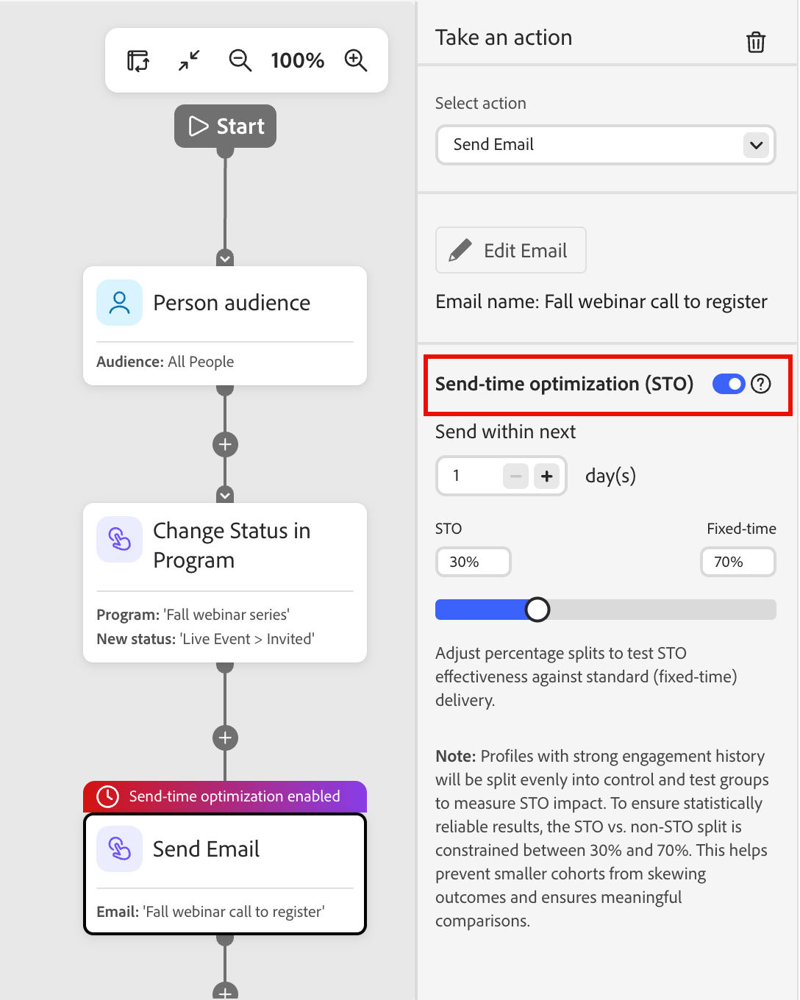

# 電子郵件傳送時間最佳化

使用傳送時間最佳化(STO)功能，透過預測每個設定檔最有可能參與的時間，個人化[個人歷程](./person-journeys.md)的電子郵件傳送時間。 STO不會使用固定的傳送時間，而是使用歷史電子郵件參與訊號，將每個收件者的傳送排程在最佳時間，藉此提升整體參與。

STO會使用大型語言模型來分析每個設定檔的歷史參與。 它會預測並排名可能的傳送時間，然後在最佳化期間內，以排名最高的時間排程傳送。

效能深入分析（例如使用情形、參與提升度，以及STO與非STO的比較）可透過Co-worker中的自然語言查詢取得。

>[!BEGINSHADEBOX]

已為STO規劃許多&#x200B;**_未來的增強功能_**：

* _[!UICONTROL 管理員]_&#x200B;區域中的全域STO設定
* 歷程層級STO啟用
* 可設定的測試/控制拆分

>[!ENDSHADEBOX]

## 設定 {#configuration}

當您[新增&#x200B;_[!UICONTROL 採取動作]_&#x200B;節點](./action-nodes.md)至個人歷程並選擇&#x200B;**[!UICONTROL 傳送電子郵件]**&#x200B;動作時，您可以設定傳送時間最佳化。

1. 選取&#x200B;_傳送電子郵件_&#x200B;歷程動作節點。

1. 在右側的節點屬性中，啟用&#x200B;**[!UICONTROL 傳送時間最佳化]**&#x200B;選項。

   {width="450" zoomable="no"}

1. 若要指定視窗和測試分佈，請設定STO選項：

   * **[!UICONTROL 下次]**&#x200B;內傳送 — 此值會決定最佳化時段（以天為單位），亦即可以傳遞電子郵件的時間範圍。 例如，對於在五天內進行的網路研討會，您可以設定四或五天的視窗。 STO會為此視窗中的每個設定檔選取最佳預測傳送時間。

   * **STO /固定分佈** - STO會自動建立&#x200B;_測試和控制分割_，以將合格的設定檔分割為最佳化和固定傳送時間。 分割可讓您直接比較效能。 （未來的增強功能預計會允許自訂分割百分比）。

   >[!NOTE]
   >
   >具有強大參與歷程記錄的設定檔會平均分割為控制和測試群組，以測量STO影響。 為了確保統計上可靠的結果，STO與非STO分割的限制在30%到70%之間。 這有助於防止較小的同類群組扭曲結果，並確保進行有意義的比較。

1. 直接在&#x200B;_[!UICONTROL 傳送電子郵件]_&#x200B;節點之後，[新增&#x200B;_等待_&#x200B;節點](./wait-nodes.md)。

   等待節點必須緊跟在啟用STO的電子郵件動作之後。 新增此節點可確保設定檔保留在歷程中，直到完全最佳化視窗被清除且所有STO傳送完成為止。 如果您省略此節點，系統會將設定標示為無效。

1. 在您完成其餘的人員歷程後，請繼續進行[發佈](./person-journeys.md#publish)。

## 報告 {#reporting}

STO效能資料可透過[同事](../agents/chat-interface.md)使用`send-time-report`技能取得。 您可以檢視摘要所有電子郵件節點的歷程層級報表，或深入研究特定電子郵件動作的節點層級報表。

報告會顯示歷程中的每個電子郵件節點，並指出是否為其啟用STO。 它也會以表格形式顯示已啟用STO和非STO電子郵件之間的比較，讓您能夠評估參與度提升度。

### 產生STO報表 {#generate-sto-report}

使用「同事」產生STO報表的方式有三種：

**使用斜線命令**

1. 在「同事」面板中，輸入`/`以顯示可用技能清單。
1. 從清單中選取&#x200B;**[!UICONTROL send-time-report]**，然後按一下向上箭頭以提交查詢。

   {width="700" zoomable="yes"}

   如果在編輯器中開啟歷程，Co-worker會自動將其用作上下文。 否則，同事會提示您指定歷程。

   同事載入報告並顯示摘要卡片。

1. 按一下&#x200B;**[!UICONTROL 開啟報告]**&#x200B;以檢視具有節點層級詳細資訊的完整報告。

**按一下電子郵件節點**

1. 在歷程畫布中，按一下&#x200B;**[!UICONTROL 傳送電子郵件]**&#x200B;節點。

1. 在「同事」面板中，要求STO報表。

   因為已選取節點，所以Co-worker會使用它作為上下文，並只傳回限定該節點範圍的報表。

   它會載入報告並顯示摘要卡片。

1. 按一下&#x200B;**[!UICONTROL 開啟報告]**&#x200B;以檢視完整報告。

**自然語言查詢**

1. 在[同事]面板中，輸入要求，例如&#x200B;_為我提供[歷程名稱]_&#x200B;的STO報告。

   同事解譯請求、載入`send-time-report`技能、產生報告並顯示摘要卡片。

1. 按一下&#x200B;**[!UICONTROL 開啟報告]**&#x200B;以檢視完整報告。

### 檢視電子郵件報表資料 {#sto-report-data}

您可以縮小「同事」面板以增加所顯示報表的大小，或捲動以檢視完整寬度。

{width="700" zoomable="yes"}

在&#x200B;_[!UICONTROL 詳細資料]_&#x200B;資料行中，按一下&#x200B;**[!UICONTROL 檢視STO結果]**&#x200B;以開啟快顯視窗。 視窗提供&#x200B;_效能比較_、_傳送時間分佈_&#x200B;和&#x200B;_資料完整性_&#x200B;的電子郵件資料視覺效果。

{width="500" zoomable="yes"}
