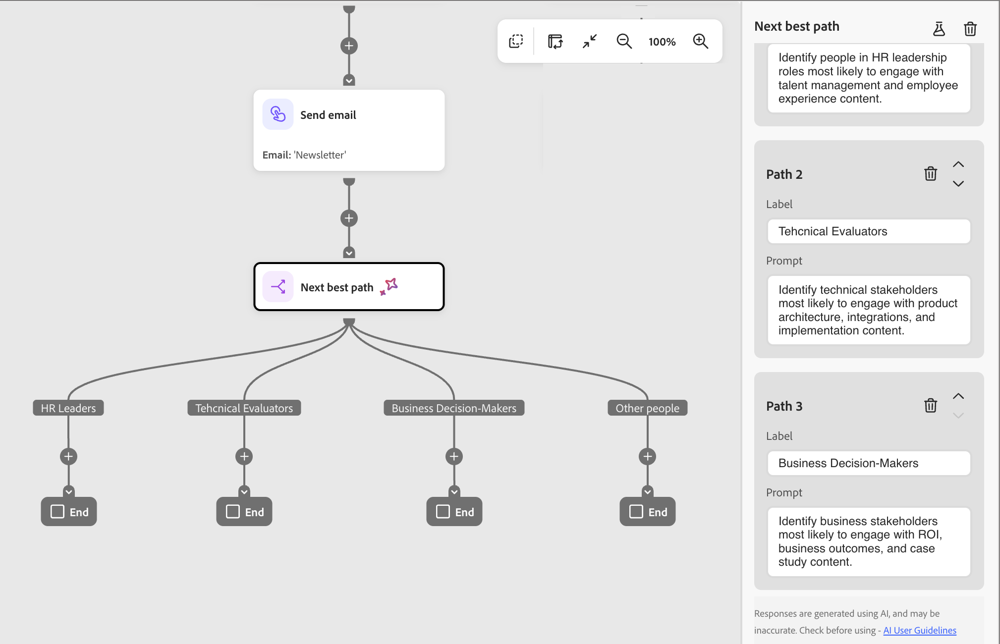
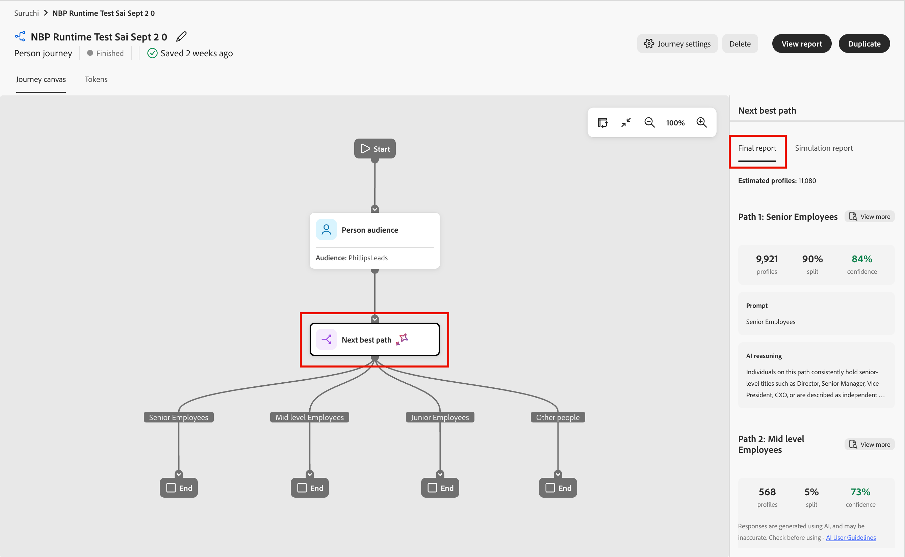

# 下一個最佳路徑節點

在[!DNL Marketo Optimizer]中，*下一個最佳路徑*&#x200B;節點會將AI驅動的分割路徑決策直接帶入歷程畫布。 您不是在[分割路徑](./split-merge-paths-nodes.md)節點上設定篩選條件，而是以自然語言描述您的意圖，讓系統決定每個人的最相關路徑。

在B2B購買中，設定檔可能看起來像是某種型別的購買者，但他們的行為、電影資料和參與情境會顯示更細微的故事。 下一個最佳路徑節點會評估該內容，以做出智慧型路由決定，同時讓您在啟動歷程之前檢閱、修改或覆寫任何AI建議。

## 路徑決策 {#path-decisioning}

從意圖到啟用，有三個步驟要執行。

* **步驟1：定義路徑** — 在歷程中新增「下一個最佳路徑」節點、命名每個路徑，並撰寫自然語言提示來說明應該沿著路徑前進的人。 您可以隨時新增或移除路徑。

* **步驟2：模擬** — 挑選範例對象並執行模擬。 您可以檢視每個路徑的設定檔計數、信賴分數和AI推理，以便在啟用之前驗證邏輯。

  >[!NOTE]
  >
  >模擬只會針對範例資料執行，不會影響即時歷程執行。

* **步驟3：啟動** — 針對您真正的對象發佈歷程。 AI會在執行階段評估每個人、即時指派最適合的路徑，而預設的遞補可確保不會將任何人排除在路徑之外。

### AI決策輸入 {#ai-decisioning-inputs}

當人員到達節點時，系統會擷取設定檔前後關聯、套用限制，並使用LLM來選取最適合的路徑。 AI會使用下列輸入的組合來評估每個人：

* **參與歷程記錄** — 來自目前和先前歷程的電子郵件開啟、連結點選、網頁瀏覽和其他行為訊號
* **即時訊號** — 高意圖事件，例如表單填寫和定價頁面造訪次數
* **個人資料屬性** — 人口統計、職稱、角色和第一類資料
* **帳戶屬性** — 與個人帳戶相關的韌體和技術資料

### AI內容建置 {#ai-context-building}

AI支援路由決定，會為每個設定檔建構推斷的圖層。 它結合人口統計和實體資料、帳戶詳細資料和行為訊號（例如個人詳細資訊、問題意圖和產品意圖）為該人員的內容摘要。 使用這個豐富的上下文，AI可以將每個人導向到最佳路徑，並提供信賴分數和每個決定背後的自然語言推理。

每個決定都以可信度分數和自然語言推理記錄，以獲得透明度和可觀察性。

如果沒有強比對路徑，或提示參考的資料不可用於設定檔，則會將人員路由至預設的遞補路徑。

## 新增下一個最佳路徑節點 {#add-node}

1. 開啟人員歷程並導覽至歷程畫布。

1. 按一下路徑上的加號( **+** )圖示，然後選擇&#x200B;**[!UICONTROL 下一個最佳路徑]**。

   按一下歷程路徑上的新增圖示後，{width="200"}

   節點會新增到畫布中，AI分割設定面板會在右側開啟。 它以一個路徑和預設&#x200B;*其他人*&#x200B;路徑開始，路由不符合任何已定義路徑資格的人。

## 設定路徑 {#configure-paths}

針對每個路徑，定義名稱和自然語言提示，說明應該路由至該路徑的人員。 提示輸入會完全取代篩選條件UI；沒有要設定的屬性條件。

1. 對於第一個路徑，請在右側面板的路徑卡中輸入屬性：

   * 輸入反映該區段對象或意圖的&#x200B;**[!UICONTROL 標籤]**。

   * 輸入自然語言的&#x200B;**[!UICONTROL 提示]**，描述誰屬於此路徑。 專注於意圖和結果，而不是特定的屬性值。

   {width="500"}

1. 按一下&#x200B;**[!UICONTROL 新增路徑]**&#x200B;以加入您想要加入的其他路徑。

   若要移除路徑，請按一下路徑卡上的&#x200B;*刪除* （  ）圖示。

   為每個路徑新增標籤和提示。

   **三路徑分割的提示範例：**

   * *路徑1 — 人力資源主管：*&#x200B;識別人力資源主管角色中最可能參與人才管理和員工經驗內容的人員。
   * *路徑2 — 技術評估人員：*&#x200B;識別最有可能參與產品架構、整合及實作內容的技術利害關係人。
   * *路徑3 — 業務決策者：*&#x200B;識別最有可能參與ROI、業務成果和案例研究內容的業務利害關係人。

   {width="600"}

1. 如有需要，請重新排序路徑，以設定比對的優先順序。

   路徑篩選是以由上到下的順序評估。 每個人都會沿著第一個符合的路徑前進。 按一下每個路徑卡右上角的向上和向下箭頭，將其在清單中向上或向下移動。

1. 檢閱&#x200B;**[!UICONTROL 其他人員]**&#x200B;預設路徑（位於路徑清單的最後一個），並視需要變更標籤。

   當AI無法放心地將人員指派給任何定義的路徑，或相關資料無法使用時，就會使用預設路徑。 當提示引用了給定設定檔的資料集中不存在的資料時，系統將該設定檔路由到預設路徑並標籤資料間隙。

>[!BEGINSHADEBOX]

**人在回圈中的控制項**

AI建議不具繫結。 在啟用歷程之前，您可以：

* 若要調整路由邏輯，請編輯任何路徑提示。
* 新增、移除或重新排序路徑。
* 視需要使用自訂條件覆寫AI建議。

在您發佈歷程之前，AI導向的路徑指派不會生效。

>[!ENDSHADEBOX]

## 依使用案例提示範例 {#prompt-examples}

下列範例說明如何在常見的B2B行銷使用案例中撰寫有效的路徑提示。 使用這些內容作為起點，並調整語言以符合您的歷程內容和受眾資料。

* 「識別過去30天內參與HR網站(shrm.org、hbr.org/topic/human-resource-management)和[!DNL Journey Optimizer]的人員，他們可能會參加有關HR營運中的AI網路研討會，並且對AI產品感興趣。」

* 「識別過去30天內參與Finance網站(wsj.com/finance,investopedia.com)對[!DNL Marketo Engage]感興趣且可能參加Financial Planning人工智慧網路研討會的人員。 他們原本也應該對AI產品表現出一些興趣。」

* 「識別過去30天內與風險/研究網站(mckinsey.com/capabilities/risk-and-resilience、forrester.com/research)和[!DNL GenStudio]互動、可能參加風險管理人工智慧相關網路研討會，且對AI產品感興趣的人員。」

## 發佈前模擬決策 {#simulate}

在歷程上線之前，使用模擬測試AI如何根據實際對象評估您的提示。 僅當歷程處於&#x200B;*草稿*&#x200B;狀態並且對任何已發佈的歷程沒有影響時，模擬才可用。

### 執行模擬 {#run-simulation}

1. 選取下一個最佳路徑節點，然後按一下右側面板頂端的&#x200B;*模擬* （  ）圖示。

1. 在對話方塊中，選擇要用於模擬對象的動態清單。

<!-- 
   * **[!UICONTROL Original person lists]** – Use the audience from the audience node. Specify a sample size when the full audience exceeds the simulation threshold.
   * **[!UICONTROL Dynamic and static lists]** – Use a [!DNL Marketo Engage] static or dynamic list.
   * **[!UICONTROL Test records]** – Use AI-suggested test profiles.
-->

![選取了動態清單的模擬路徑對話方塊以及[取消]和[模擬]按鈕。](./assets/next-best-path-simulate-paths.png){width="250"}

>[!NOTE]
>
>* 如果選取的對象超過模擬臨界值，系統會在100個設定檔範例上執行模擬。 UI中的指示器會顯示以範例為基礎的結果。
>* 如果選取的對象尚未具體化，則會封鎖模擬。 內嵌警告會指導您先實體化對象。

1. 按一下&#x200B;**[!UICONTROL 模擬]**。

### 檢閱模擬結果 {#review-results}

模擬執行後，右側面板會顯示每個路徑上的設定檔分佈，以及這些任務背後的AI推理：

| 結果 | 說明 |
|---|---|
| **輪廓** | 路由至路徑的設定檔數目。 |
| **分割** | 路由至路徑的設定檔百分比。 |
| **信賴度** | 路徑指派的AI信賴水準。 信賴度可反映資料的時效性、訊號強度和一致性，以及類似路由模式的歷史成功。 |
| **提示** | 已針對路徑評估的提示。 |
| **AI推理** | 說明為何將設定檔集體指派給此路徑的自然語言說明。 |

{width="600"}

>[!NOTE]
>
>當可用的資料或範圍限制決定時，結果會包括有關限制的資訊。 例如，當資料集中不存在必要的屬性時，結果會包含明確指標，說明缺少資料如何影響結果。

使用結果來調整提示，並確認製程反映您預期的結果。 您可以修改路徑提示，並在發佈前視需要多次重新執行模擬。

## 發佈和監視歷程 {#publish-monitor}

驗證模擬結果後：

1. 將人物對象連線至歷程進入節點。

1. [發佈此歷程](./person-journeys.md#publish)。

歷程上線後，下一個最佳路徑節點會在執行時執行。 當每個人都到達節點時，AI會使用最新訊號即時評估他們，並將其路由到最相關的路徑。

針對已發佈的歷程，開啟歷程畫布並選取下一個最佳路徑節點，以在右側面板中檢視&#x200B;**_[!UICONTROL 最終結果]_**&#x200B;區段。 最終結果顯示：

* 每個路徑中的設定檔分佈百分比
* 每個路徑指派的信賴度分數
* 路徑層級和設定檔層級推理，包含個別設定檔的可展開細節

{width="600"}

即時結果也可透過[同事聊天介面](../agents/chat-interface.md)中的歷程可觀察性技能取得。
