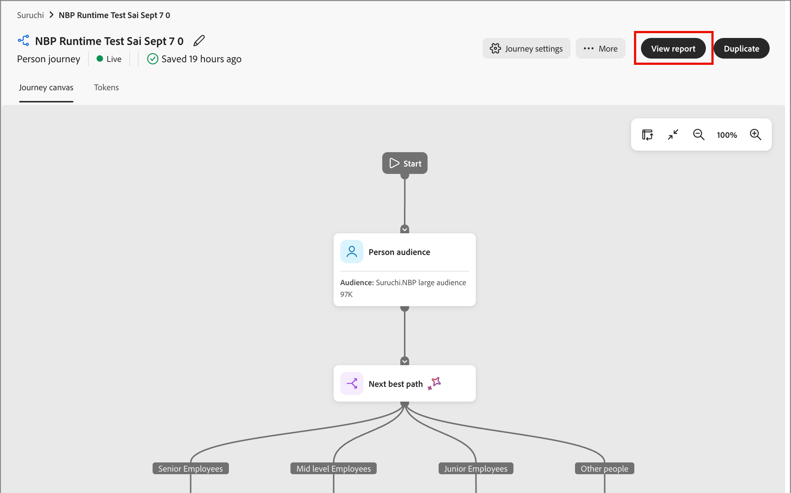

# 個人歷程個人報告

<!-- SPHR-39120: UX plans to move the Journey activity flow tile to the top of the report. Update the tile order in this page when that ships. -->

按一下&#x200B;**[!UICONTROL 檢視報表]**&#x200B;以取得即時或完成的人員歷程，以檢視其績效，包括狀態、參與度、電子郵件量度和活動流程。

檢視報告(_T):_

1. 從&#x200B;_[!UICONTROL 個人歷程]_&#x200B;清單開啟&#x200B;**[!UICONTROL 即時]**&#x200B;或&#x200B;**[!UICONTROL 已完成]**&#x200B;個人歷程。
1. 在歷程標題中，選取&#x200B;**[!UICONTROL 檢視報告]**。

   {width="600" zoomable="yes"}

您可以[變更報告的日期範圍](./reports-overview.md#change-the-date-range)。

選取報表頂端的&#x200B;**[!UICONTROL 共用]**&#x200B;以下載或排程資料匯出。 請參閱報表概觀中的&#x200B;[_匯出報表_](./reports-overview.md#export-a-report)。

{width="700" zoomable="yes"}

## 篩選器 {#filters}

報告篩選器的範圍設定為目前的歷程。

* **[!UICONTROL 歷程名稱（事件）]** — 預先設定為您開啟報告的歷程。
* **[!UICONTROL 角色（事件）]** - （_尚未支援_）將報告篩選為符合特定[衍生角色](../audiences/personas.md#filter-by-derived-persona)的人員。 預設為[!UICONTROL 沒有篩選器]。

選取&#x200B;**[!UICONTROL 全部重設]**&#x200B;以清除&#x200B;_[!UICONTROL 角色（事件）]_&#x200B;篩選器並返回預設檢視。

## 個人狀態和參與 {#person-status-and-engagement}

本節介紹四個圖磚：

* **[!UICONTROL 歷程中的人員狀態]** — 將歷程中的人員分成&#x200B;_[!UICONTROL 已完成]_&#x200B;和&#x200B;_[!UICONTROL 進行中]_&#x200B;類別，並包含對應的百分比。
* **[!UICONTROL 一段時間內的已完成人數]** — 追蹤選定日期範圍內完成歷程人數的折線圖。
* **[!UICONTROL 已參與和未參與的人員]** — 將歷程中的人員分為&#x200B;_[!UICONTROL 已參與]_&#x200B;和&#x200B;_[!UICONTROL 未參與]_&#x200B;類別，並提供對應的百分比。
* **[!UICONTROL 參與的人]** — 符合參與歷程資格的人總數。

## 電子郵件績效 {#email-performance}

[!UICONTROL 電子郵件效能]表格顯示歷程中傳送之每封電子郵件的傳遞和參與量度。 如需所有歷程的相同電子郵件量度，請參閱[電子郵件參與報告](./email-engagement-report.md)。

{width="700" zoomable="yes"}

[!UICONTROL 電子郵件效能]資料表資料行：

* [!UICONTROL 電子郵件名稱] — 電子郵件的名稱。
* [!UICONTROL 已傳送] — 已傳送的電子郵件數目。
* [!UICONTROL 已傳遞] — 已傳遞的電子郵件數目。
* [!UICONTROL %已傳遞] — 已傳遞電子郵件數除以已傳送數目。
* [!UICONTROL 已開啟] — 收件者開啟電子郵件的次數。
* [!UICONTROL %已開啟] — 已開啟電子郵件數除以傳遞數目。
* [!UICONTROL 已點按] — 收件者點按電子郵件中連結的次數。
* [!UICONTROL %已點按] — 已點按電子郵件數除以傳遞數目。

## 歷程活動流程 {#journey-activity-flow}

[!UICONTROL 歷程活動流程]視覺效果會顯示人員通過歷程的路徑，從&#x200B;_[!UICONTROL 將人員新增至歷程]_&#x200B;活動開始。 每個節點顯示該活動的路徑檢視次數。

{width="700" zoomable="yes"}
