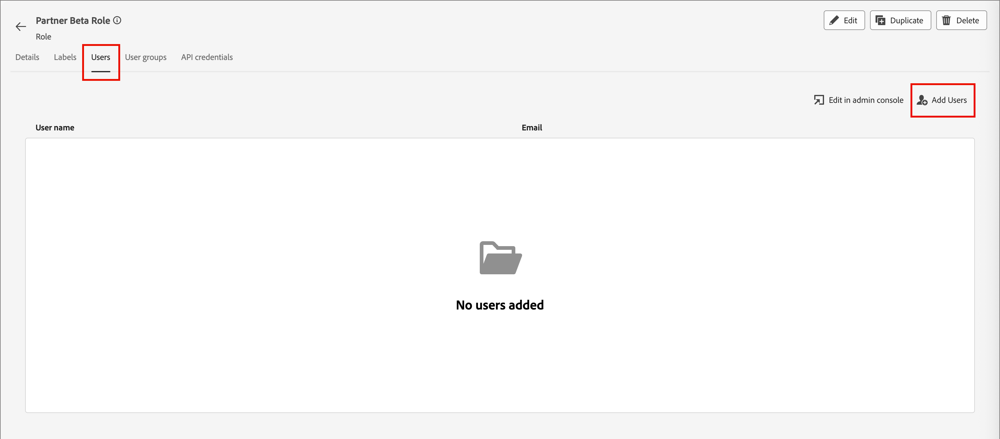
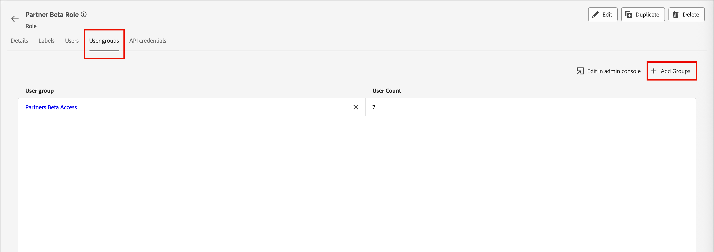

# 使用者存取和許可權

布建完成並繫結沙箱後，請完成下列步驟，為您的團隊和使用者提供[!DNL Marketo Optimizer]存取權。

1. [在Admin Console中建立 [!DNL Journey Optimizer B2B Edition] 產品設定檔](#create-profile) （僅限一次性/初始設定）。
1. 在Admin Console中[新增使用者群組](#add-user-group)。
1. [將產品設定檔](#assign-profile)指派給Admin Console中的使用者群組。
1. [在Admin Console中將使用者新增至新群組](#add-users)。
1. 在Adobe Experience Platform中[編輯內建角色](#edit-role-permissions)或[建立具有[!DNL Journey Optimizer B2B Edition]許可權的自訂角色](#create-a-custom-role)。
1. [新增使用者](#add-users-to-a-role)或[群組](#add-user-groups-to-a-role)至Adobe Experience Platform中的角色。

## 設定產品設定檔 {#config-profile}

作為管理員，您可以在[!DNL Adobe Admin Console]中完成這些工作，這是管理及管理Adobe產品授權和使用者的中心位置。 在Admin Console中，您可以在單一位置而非在各種個別解決方案中建立和管理使用者。 若要瞭解其功能的詳細資訊，請參閱[Admin Console概觀](https://helpx.adobe.com/business/enterprise/plan-your-deployment/basic-concepts/admin-console.html)頁面。

### 存取Admin Console {#admin-console}

在使用Admin Console管理團隊中的使用者之前，您需要確保您可以存取Admin Console並擁有適當的許可權。

1. 作為系統管理員，您應該會在上線流程中收到來自Adobe的多封電子郵件。

   找到歡迎電子郵件，提供您被授予存取權的組織名稱相關資訊。

1. 按一下歡迎電子郵件中的&#x200B;**[!UICONTROL 開始使用]**&#x200B;連結，以瀏覽至Admin Console。

   如果找不到電子郵件，請直接在[https://adminconsole.adobe.com](https://adminconsole.adobe.com)開啟瀏覽器並存取Admin Console。

1. 使用您的Adobe ID登入。

   登入成功後，您會看到Adobe Admin Console的&#x200B;_概觀_&#x200B;頁面。

1. 如果您可以存取多個組織，請確保您已登入正確的組織。

   若要變更您的組織，請按一下右上角的組織名稱，然後選擇您需要存取的組織。

1. 從&#x200B;_[!UICONTROL 使用者]_&#x200B;卡中選擇&#x200B;**[!UICONTROL 管理員]**&#x200B;以驗證您是系統管理員。

   ![Admin Console概觀 — 按一下[管理員]](./assets/admin-console-overview-administrators.png){width="800" zoomable="yes"}

1. 透過輸入您的Adobe ID電子郵件、使用者名稱、名字或姓氏進行搜尋。

   * 如果您的存取權設定正確，搜尋會傳回您的記錄。

   * 如果&#x200B;**[!UICONTROL 管理員角色]**&#x200B;欄中的值顯示`System`，您就知道您（或顯示的使用者）是系統管理員。

### 建立[!DNL Journey Optimizer B2B Edition]產品設定檔 {#create-profile}

在授與使用者Adobe解決方案的存取權時，您不一定要授與他們完整的存取權。 產品設定檔使每個解決方案都可以擁有自己的一組使用者許可權。 使用Admin Console指派產品設定檔。

如需有關使用產品設定檔取得使用者許可權的詳細資訊，請參閱Admin Console檔案中的&#x200B;[_管理企業使用者的產品設定檔_](https://helpx.adobe.com/business/enterprise/manage-products-and-entitlements/manage-products-and-product-profiles/manage-product-profiles.html){target="_blank"}。

{width="30"}系統管理員或[!DNL Experience Platform]產品管理員可以從[https://adminconsole.adobe.com](https://adminconsole.adobe.com)執行下列步驟。

1. 選取「**[!UICONTROL 產品]**」標籤。

1. 開啟您想要新增設定檔的[!DNL Journey Optimizer B2B Edition]執行個體，然後按一下&#x200B;**[!UICONTROL 新增設定檔]**。

   {width="600" zoomable="yes"}的產品設定檔

1. 輸入產品設定檔名稱，例如&#x200B;_B2B使用者_。

1. 按一下[下一步]&#x200B;**&#x200B;**，然後按一下[儲存]&#x200B;**&#x200B;**。

### 新增使用者群組 {#add-user-group}

使用者群組是獲授一組共用許可權的使用者集合。 您可以在使用者群組中新增或移除使用者。 當群組內的使用者變更時，群組權限會維持不變。

如需有關如何使用使用者群組來管理許可權的詳細資訊，請參閱Admin Console檔案中的[管理使用者群組](https://helpx.adobe.com/business/enterprise/manage-users/user-groups.html){target="_blank"}。

{width="30"}系統管理員可以從[https://adminconsole.adobe.com](https://adminconsole.adobe.com)執行下列步驟。

1. 選取&#x200B;**[!UICONTROL 使用者]**&#x200B;索引標籤。

1. 在左側導覽中選擇&#x200B;**[!UICONTROL 使用者群組]**。

1. 按一下右上角的&#x200B;**[!UICONTROL 新增使用者群組]**。

1. 輸入使用者群組的名稱，例如&#x200B;_B2B使用者_，然後按一下&#x200B;**[!UICONTROL 儲存]**。

   {width="600" zoomable="yes"}

### 指派產品設定檔 {#assign-profile}

{width="30"}產品管理員可以從[https://adminconsole.adobe.com](https://adminconsole.adobe.com)執行下列步驟。

1. 按一下您建立的使用者群組。

1. 選取&#x200B;**[!UICONTROL 指派的產品設定檔]**&#x200B;索引標籤，然後按一下&#x200B;**[!UICONTROL 指派設定檔]**。

1. 按一下&#x200B;**+**&#x200B;並新增下列產品的每個執行個體：

   * [!UICONTROL Adobe Journey Optimizer B2B edition — 使用者設定檔]
   * [!UICONTROL Adobe Experience Platform - AEP-Default-All-Users]
   * [!UICONTROL Adobe Experience Platform Data Collection — 預設資料收集所有存取權]
   * [!UICONTROL Adobe Experience Platform — 預設的生產所有存取權]

   {width="600" zoomable="yes"}

1. 按一下&#x200B;**[!UICONTROL 儲存]**。

### 將使用者新增至新群組 {#add-users}

如需使用者管理的相關資訊，請參閱Admin Console檔案中的&#x200B;[_Adobe Admin Console使用者_](https://helpx.adobe.com/business/enterprise/manage-users/users.html){target="_blank"}。

{width="30"}系統管理員或產品管理員可以從[https://adminconsole.adobe.com](https://adminconsole.adobe.com)執行下列步驟。 產品管理員只能新增其組織中已存在的使用者。

1. 如果使用者不是您組織的成員，請新增每個使用者：

   * 在&#x200B;_[!UICONTROL 快速連結]_&#x200B;下，按一下&#x200B;**[!UICONTROL 新增使用者]**。

   * 輸入使用者的電子郵件地址，然後按一下&#x200B;**[!UICONTROL 新增為新的使用者]**。

     {width="600" zoomable="yes"}

   * 輸入名字和姓氏，然後按一下[儲存]。**&#x200B;**

1. 將每位使用者新增至群組：

   * 按一下使用者名稱。

   * 在使用者詳細資訊頁面中，捲動至&#x200B;**[!UICONTROL 使用者群組]**。

   * 按一下左側的&#x200B;_更多_ ( **...** )圖示，然後選擇&#x200B;**[!UICONTROL 編輯使用者群組]**。

   * 按一下&#x200B;**[!UICONTROL 使用者群組]**&#x200B;下方的&#x200B;_新增_ ( **+** )圖示。

     {width="600" zoomable="yes"}

   * 選取您先前建立的使用者群組，然後按一下&#x200B;**[!UICONTROL 套用]**。

   * 按一下&#x200B;**[!UICONTROL 儲存]**&#x200B;以取得使用者變更。

## 指派產品許可權 {#assign-product-permissions}

許可權是統一許可權，可讓您定義指派給產品設定檔的授權。 每個許可權都會分組在功能下，例如人員歷程或內容，代表[!DNL Marketo Optimizer]中的功能。

Adobe Experience Platform的&#x200B;_許可權_&#x200B;區域是管理員可以定義使用者角色和存取原則，以管理產品應用程式內功能和物件的存取許可權。 在此應用程式中，您可以建立和管理角色，並為這些角色指派所需的資源許可權。 許可權也可讓您管理與特定角色相關聯的沙箱和使用者。

如需Experience Platform中角色許可權的詳細資訊，請參閱Experience Platform檔案中的[管理角色](https://experienceleague.adobe.com/en/docs/experience-platform/access-control/abac/permissions-ui/permissions){target="_blank"}。

1. 移至[experience.adobe.com](https://experience.adobe.com/)。

1. 在&#x200B;_[!UICONTROL 快速存取]_&#x200B;面板中，選取&#x200B;**[!UICONTROL 許可權]**。

   >[!NOTE]
   >
   >如果您沒有看到&#x200B;_[!UICONTROL 許可權]_，您可能需要按一下「檢視全部&#x200B;**[!UICONTROL 」]**，然後從可用的應用程式中選取它。

   {width="700" zoomable="yes"}

### 權限 {#permissions}

下列許可權可控制[!DNL Marketo Optimizer]中管道設定、內容管理和人員歷程功能的存取權：

| 類別 | 權限 | 說明 |
| -------- | ----------- | ---------- |
| B2B通道設定 | 檢視B2B電子郵件設定 | 檢視電子郵件設定（子網域、PTR記錄、IP集區、隱藏清單、種子清單、IP熱身計畫）。 |
| | 管理B2B電子郵件設定 | 設定電子郵件設定（子網域、PTR記錄、IP集區、隱藏清單、種子清單、IP熱身計畫）。 使用者傳送電子郵件前，必須先完成這些設定。 |
| | 管理B2B管道設定 | 存取左側導覽中的&#x200B;_管道_&#x200B;功能表專案以及所有管道設定作業。 |
| | 管理B2B WhatsApp預設集 | 建立、檢視和刪除WhatsApp訊息預設集和相關的SMS設定。 |
| B2B歷程 | 管理B2B個人歷程 | 存取&#x200B;_個人歷程_&#x200B;清單和所有個人歷程作業。 |
| B2B Assets | 檢視內容範本 | 檢視內容範本清單和詳細資訊。 |
| | 管理B2B範本 | 建立、編輯和刪除內容範本。 |
| | 檢視B2B片段 | 檢視內容片段清單和詳細資訊。 |
| | 管理B2B片段 | 建立、編輯和刪除內容片段。 |
| | 發佈B2B片段 | 發佈內容片段，以用於範本、電子郵件和登入頁面。 |
| | 檢視B2B Assets | 檢視Assets程式庫和資產檔案的詳細資訊。 |
| | 管理B2B Assets | 建立、編輯和刪除資產檔案。 |
| | 檢視B2B電子郵件 | 檢視電子郵件訊息。 |
| | 管理B2B電子郵件 | 建立、編輯和刪除電子郵件訊息。 |
| | 管理B2B訊息匯出 | 匯出電子郵件區段下的訊息報表。 |
| Journey Optimizer資料庫 | 管理B2B程式庫專案 | 新增和刪除程式庫中儲存的運算式。 |
| 資料治理 | 管理B2B刪除使用標籤 | 檢視、建立和刪除套用至資料集和結構描述的資料使用標籤(DULE)。 |
| 沙箱管理 | 管理B2B套件 | 建立、匯出、匯入、複製和刪除沙箱套件。 |

若要在[!DNL Marketo Optimizer]中提供外部目的地的支援，需要下列許可權：

| 類別 | 權限 | 說明 |
| -------- | ----------- | ---------- |
| 儀表板 | 檢視標準儀表板 | 對&#x200B;_設定檔_、_目的地_&#x200B;和&#x200B;_區段_&#x200B;儀表板的僅限檢視存取權。 也可讓您存取左側導覽中的&#x200B;_儀表板_，以及&#x200B;_儀表板_&#x200B;詳細目錄和整合標籤。 |
| | 管理標準儀表板 | 新增尚未在Data Warehouse的自訂屬性。 |
| 目的地 | 檢視目的地 | 僅供檢視的存取權，可檢視&#x200B;_目錄_&#x200B;索引標籤中的可用目的地以及&#x200B;_瀏覽_&#x200B;索引標籤中的已驗證目的地。 |
| | 管理目的地 | 檢視、建立及刪除目的地連線和目的地帳戶。 |
| | 啟用目的地 | 啟用作用中目的地的資料。 若要存取此函式，也需要&#x200B;_檢視目的地_&#x200B;或&#x200B;_管理目的地_。 |
| | 啟用區段而不進行對應 | 啟用現有目的地的對象，不顯示對應步驟。 使用者可以在啟動工作流程中新增和移除對象，但無法新增或移除對應的屬性或身分。 存取此函式也需要&#x200B;_檢視目的地_&#x200B;許可權。 |
| | 管理和啟用資料集目的地 | 檢視、建立、編輯和停用資料集匯出流程，以及啟用作用中資料集的資料。 存取此函式也需要&#x200B;_檢視目的地_&#x200B;許可權。 |
| | 目的地製作 | 能夠使用Adobe Experience Platform Destination SDK編寫目的地。 |
| 資料治理 | 檢視資料使用原則 | 屬於您組織的資料使用原則的僅限檢視存取權。 |
| | 管理資料使用原則 | 檢視、建立、編輯和刪除資料使用原則。 |
| 資料擷取 | 檢視來源 | 對&#x200B;_目錄_&#x200B;索引標籤中的可用來源以及&#x200B;_瀏覽_&#x200B;索引標籤中的已驗證來源的僅檢視存取權。 |
| | 管理來源 | 檢視、建立、編輯和停用來源。 |
| 輪廓管理 | 檢視設定檔設定 | 僅供檢視即可存取所有設定檔設定。 |
| | 管理設定檔設定 | 檢視並編輯所有設定檔設定。 |

<!--

### B2B built-in roles {#b2b-built-in-roles}

When your organization has [!DNL Journey Optimizer B2B Edition] provisioned, Experience Platform includes a set of built-in (default) roles that you can use to manage access to the product capabilities:

| Role | Permissions |
| ---- | ----------- |
| B2B Journey Manager | <li>Manage B2B Journeys <li>Manage B2B Buying Groups <li>Manage B2B Account Lists <li>View B2B Engagement Dashboard <li>View B2B Insights Dashboard |
| B2B Channel Manager | <li>Manage B2B Assets <li>Manage B2B Templates <li>Manage B2B Fragments |
| B2B System Administrator | <li>Manage B2B Channels Configurations <li>Manage B2B Admin Configurations |
| B2B Sales User | <li>View B2B Engagement Dashboard <li>View B2B Buying Groups <li>Access In-CRM Insights |

-->

### 編輯角色許可權 {#edit-role-permissions}

對於內建或自訂角色，您可以隨時決定新增或刪除許可權。 如果您修改預設或自訂角色，則會影響指派給該角色的每個使用者。

>[!IMPORTANT]
>
>[!DNL Marketo Optimizer]存取權需要您啟用使用下列命名慣例布建的特定沙箱： Marketo Engage訂閱首碼+ Prime。 例如，如果連結的Marketo Engage訂閱首碼為&#x200B;_AcmeAssoc_，則存取[!DNL Marketo Optimizer]所需的沙箱為&#x200B;_AcmeAssocPrime_。

>[!NOTE]
>
>Admin Console系統管理員可以執行這些步驟。

若要變更角色&#x200B;:_的許可權(_T)

1. 在左側導覽中選取&#x200B;**[!UICONTROL 角色]**。

1. 按一下&#x200B;**_B2B頻道管理員_**&#x200B;角色名稱。

1. 在詳細資訊頁面中，按一下右上方的&#x200B;**[!UICONTROL 編輯]**。

   {width="800" zoomable="yes"}

   在角色編輯器中，_[!UICONTROL 資源]_&#x200B;功能表會顯示套用至Experience Cloud - Platform支援之應用程式的資源清單。

1. 選取為[!DNL Marketo Optimizer]存取權布建的沙箱(`<Marketo subscription prefix>Prime`)。

   {width="800" zoomable="yes"}

1. 按一下每個B2B資源的&#x200B;_新增_&#x200B;圖示(**+**)。

   {width="700" zoomable="yes"}

1. 為每個資源新增特定許可權，或選取&#x200B;**[!UICONTROL 全部新增]**。

1. 按一下&#x200B;**[!UICONTROL 儲存]**。

   <!-- {width="700" zoomable="yes"} -->

1. 按一下&#x200B;**[!UICONTROL 關閉]**&#x200B;以返回詳細資料頁面。

### 將使用者新增至角色 {#add-users-to-a-role}

{width="30"}系統管理員或Experience Platform管理員可以執行下列步驟。

1. 開啟角色詳細資料，並選取&#x200B;**[!UICONTROL 使用者]**&#x200B;索引標籤。

   此標籤會顯示指派給角色的所有使用者清單。

1. 按一下&#x200B;**[!UICONTROL 新增使用者]**。

   {width="800" zoomable="yes"}

1. 在&#x200B;_[!UICONTROL 新增使用者]_&#x200B;對話方塊中，找出並選取您要新增至角色的使用者。

   * 您可以使用搜尋工具來篩選使用者清單。

   * 選取每個使用者的核取方塊。

   {width="600" zoomable="yes"}

1. 當您選取要新增的所有使用者時，請按一下&#x200B;**[!UICONTROL 儲存]**。

### 將使用者群組新增至角色 {#add-user-groups-to-a-role}

如需使用者管理的相關資訊，請參閱Admin Console檔案中的&#x200B;[_Adobe Admin Console使用者_](https://helpx.adobe.com/business/enterprise/manage-users/users.html){target="_blank"}。

{width="30"}系統管理員或Experience Platform管理員可以執行下列步驟。

1. 開啟角色詳細資料，並選取&#x200B;**[!UICONTROL 使用者群組]**&#x200B;索引標籤。

   此標籤會顯示指派給角色的所有使用者群組清單。

1. 按一下&#x200B;**[!UICONTROL 新增群組]**。

   {width="800" zoomable="yes"}

1. 在&#x200B;_[!UICONTROL 新增群組]_&#x200B;對話方塊中，找出並選取您要新增至角色的群組。

   * 您可以使用搜尋工具來篩選使用者群組清單。

   * 選取每個使用者群組的核取方塊。

   {width="600" zoomable="yes"}

1. 當您選取要新增的所有群組時，請按一下&#x200B;**[!UICONTROL 儲存]**。

### 建立自訂角色 {#create-a-custom-role}

{width="30"}系統管理員或Experience Platform管理員可以執行下列步驟。

1. 在左側導覽中選取&#x200B;**[!UICONTROL 角色]**，然後選取&#x200B;**[!UICONTROL 建立角色]**。

1. 在&#x200B;_[!UICONTROL 建立新角色]_&#x200B;對話方塊中，輸入角色的名稱，例如&#x200B;_B2B行銷人員_，以及說明（選擇性）。

1. 按一下「**[!UICONTROL 確認]**」。

1. 選取為[!DNL Marketo Optimizer]存取權布建的沙箱(`<Marketo subscription prefix>Prime`)。

   {width="800" zoomable="yes"}

1. 新增B2B產品許可權：

   若要決定您想要用於角色的產品功能，請參閱[產品許可權](#permissions)清單。

   在左側的&#x200B;_[!UICONTROL 資源]_&#x200B;清單中，找到B2B專案，然後按一下&#x200B;_新增_ (**+**)圖示以新增您想要為角色啟用的每個屬性。

   您可以在搜尋工具中輸入&#x200B;_B2B_，以篩選許多B2B產品許可權的清單。

   {width="700" zoomable="yes"}

1. 按一下右上角的&#x200B;**[!UICONTROL 儲存]**。

1. 前往角色詳細資料，並選取&#x200B;**[!UICONTROL 使用者群組]**&#x200B;標籤。

1. 按一下&#x200B;**[!UICONTROL 新增群組]**。

1. 選取您先前在Admin Console中建立的使用者群組旁的核取方塊。

1. 按一下&#x200B;**[!UICONTROL 儲存]**。

您的自訂角色已設定，而且指派群組中的使用者現在可以存取您選取的[!DNL Marketo Optimizer]權能。
